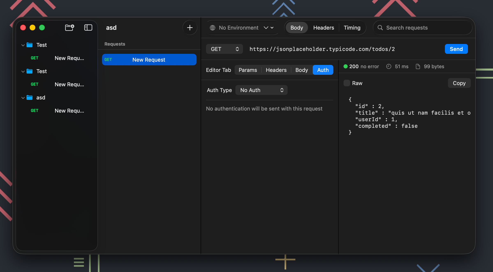

# PostKit

A native macOS HTTP client for API development and testing. Built with SwiftUI and SwiftData.

PostKit is a lightweight alternative to tools like Postman and Insomnia, designed to feel at home on macOS with native performance, Keychain-backed credential storage, and a familiar three-column layout.



## Features

**Request Builder**

- HTTP methods: GET, POST, PUT, PATCH, DELETE, HEAD, OPTIONS
- Query parameters and headers with enable/disable toggles
- Body types: JSON, XML, Form Data, URL-Encoded, Raw Text
- Authentication: Bearer Token, Basic Auth, API Key (header or query)

**Collections & Organization**

- Organize requests into collections and nested folders
- Drag-and-drop reordering
- Duplicate requests with a single shortcut

**Environments & Variables**

- Multiple environments per collection (Dev, Staging, Production)
- Variable interpolation with `{{variableName}}` syntax
- Built-in variables: `$timestamp`, `$uuid`, `$randomInt`, `$isoTimestamp`, `$randomString`
- Mark variables as secret for Keychain-backed storage

**Import & Export**

- Import from cURL commands
- Import from OpenAPI 3.x specifications
- Export/import collections as JSON with automatic credential redaction

**Response Viewer**

- Body, Headers, and Timing tabs
- Response time and size metrics
- Large response streaming (>1MB written to disk)

**Security**

- Credentials stored in macOS Keychain
- Sensitive headers redacted on export
- App Sandbox enabled

## Requirements

- macOS 15.0+
- Xcode 16.0+

## Build

Clone the repository and open the Xcode project:

```bash
git clone git@github.com:adryanev/PostKit.git
cd PostKit/PostKit
open PostKit.xcodeproj
```

Select the **PostKit** scheme and build with `Cmd+B`, or run with `Cmd+R`.

## Keyboard Shortcuts

| Shortcut | Action |
|---|---|
| `Cmd+Enter` | Send request |
| `Cmd+.` | Cancel request |
| `Cmd+D` | Duplicate request |
| `Cmd+Shift+I` | Import cURL command |
| `Cmd+Shift+O` | Import OpenAPI spec |
| `Cmd+Option+I` | Import collection |
| `Ctrl+Tab` | Cycle focus between panes |

## Architecture

PostKit follows **MVVM** with SwiftUI and SwiftData:

- **Models** — SwiftData `@Model` classes: `HTTPRequest`, `RequestCollection`, `Folder`, `APIEnvironment`, `Variable`, `HistoryEntry`
- **Views** — SwiftUI views organized by feature: Sidebar, RequestList, RequestEditor, ResponseViewer, Environment, Import
- **ViewModels** — `@Observable` view models handling request execution and state
- **Services** — `HTTPClient` (actor-based), `CurlParser`, `OpenAPIParser`, `FileExporter`, `VariableInterpolator`, `KeychainManager`

## License

This project is not yet licensed. All rights reserved.
