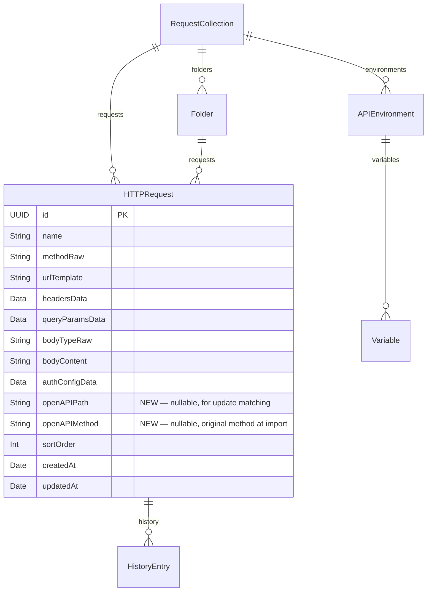

# OpenAPI YAML/JSON Import with Create/Update

## Enhancement Summary

**Deepened on:** 2026-02-13
**Research agents used:** Performance Oracle, Security Sentinel, Code Simplicity Reviewer, Architecture Strategist, Pattern Recognition Specialist, Data Integrity Guardian, SwiftUI Wizard Research, OpenAPI Parsing Research

### Key Improvements from Research

1. **Critical: DiffResult must use snapshots, not @Model refs** — `[HTTPRequest]` in a `Sendable` struct won't compile under strict concurrency. Use `EndpointSnapshot` with `requestID: UUID?` throughout.
2. **Critical: Keychain cleanup on delete** — `AuthConfig.deleteSecrets(forRequestID:)` must be called before deleting any `HTTPRequest`, or Keychain entries leak permanently.
3. **Critical: Transaction safety** — `updateCollection` must batch all changes and call `context.save()` exactly once. No partial saves.
4. **Architecture: Extract OpenAPIImportViewModel** — wizard state belongs in a dedicated `@Observable` ViewModel per ADR-004/ADR-013, not scattered as `@State` in the view.
5. **Architecture: Store `openAPIMethod` alongside `openAPIPath`** — if a user changes an imported request's method, the match key breaks without this.
6. **Parser: Explicit HTTP method whitelist** — don't rely on `HTTPMethod(rawValue:)` failing for non-method path item keys (`summary`, `parameters`, `$ref`).
7. **Parser: Skip `$ref` parameters gracefully** — check for `"$ref"` key and skip instead of producing empty parameters. Show `$ref` skip count in UI.
8. **Parser: Merge path-level + operation-level parameters** — operation-level overrides path-level by `(name, in)` key per OpenAPI spec.
9. **Parser: Sort endpoints deterministically** — `(path, method)` sort after parsing for consistent UI and diff.
10. **Competitive differentiator** — PostKit's update-with-diff is genuinely novel; Postman, Insomnia, and Bruno all lack this.

### Scope Decision Point

The **Code Simplicity Reviewer** recommends a ~70% scope reduction (cut diff engine, conflict UI, security schemes, server variables). This would reduce the feature to: YAML support + tag extraction + simple "replace all imported" update. See [Appendix: Simplification Option](#appendix-simplification-option) for the full analysis and a decision framework.

---

## Overview

Enhance PostKit's OpenAPI import to support both YAML and JSON specs, with intelligent create-or-update collection targeting. Users always choose whether to create a new collection or update an existing one. Updates use a smart merge: new endpoints are auto-added, changed endpoints show a side-by-side diff for keep/replace decisions, and removed endpoints are flagged for deletion. The import also extracts tags→folders, security schemes→auth config, and servers→environments.

## Problem Statement

The current OpenAPI import (`Cmd+Shift+O`) is limited:
- **JSON only** — YAML specs (the most common format) are unsupported
- **Create only** — always creates a new collection; no way to update when a spec changes
- **Minimal extraction** — ignores tags, security schemes, server variables, query parameters, and path parameter templating

API specs change frequently during development. Without update capability, users must delete and re-import collections, losing all customizations (headers, auth tokens, body tweaks).

### Research Insights: Competitive Landscape

| Capability | Postman | Insomnia | Bruno | **PostKit (Planned)** |
|---|---|---|---|---|
| Create new collection | Yes | Yes | Yes | Yes |
| Update existing collection | API Builder only | No | No | **Yes (differentiator)** |
| Selective endpoint import | No | Scan step | No | **Yes** |
| Conflict resolution | No | No | No | **Yes (side-by-side diff)** |
| Tag-to-folder mapping | Yes | Yes | Yes | Yes |
| Server-to-environment | Variables only | No | No | **Yes (full environment)** |
| YAML support | Yes | Yes | Yes | Planned (Yams) |

All three competitors lack update-with-diff. This is PostKit's primary differentiator in the import flow. Postman's re-import is all-or-nothing (losing scripts and tweaks). Insomnia and Bruno require delete-and-recreate.

## Proposed Solution

Evolve the existing `OpenAPIImportSheet` into a **multi-step wizard** within a sheet:

| Step | Name | Description |
|------|------|-------------|
| 1 | **File Select** | Pick YAML/JSON file via NSOpenPanel, parse and validate |
| 2 | **Target** | Choose "Create new collection" or select an existing collection to update |
| 3 | **Configure** | Server picker, endpoint list with tag→folder preview, collapsible auth/environment sections |
| 4 | **Conflicts** | (Update mode only) Side-by-side diff for changed/removed endpoints with keep/replace/delete toggles |

## Technical Approach

### Architecture

```
┌─────────────────────────────────────────────────────────────┐
│ OpenAPIImportSheet (Multi-Step Wizard)                      │
│ └── OpenAPIImportViewModel (@Observable)                    │
│                                                             │
│  Step 1: File Select ──► OpenAPIParser.parse(data)          │
│  Step 2: Target      ──► Query existing RequestCollections  │
│  Step 3: Configure   ──► EndpointSelectionView              │
│  Step 4: Conflicts   ──► OpenAPIDiffEngine + DiffView       │
│                                                             │
│  Import Button ──► OpenAPIImporter.import(...)              │
└─────────────────────────────────────────────────────────────┘

┌──────────────┐     ┌──────────────────┐     ┌──────────────┐
│ OpenAPIParser│     │ OpenAPIDiffEngine│     │OpenAPIImporter│
│  (Sendable)  │     │   (Sendable)     │     │ (@MainActor) │
│              │     │                  │     │              │
│ parse(data)  │     │ diff(spec,       │     │ importNew()  │
│ → OpenAPI-   │     │   snapshots)     │     │ updateColl() │
│   Spec       │     │ → DiffResult     │     │              │
└──────────────┘     └──────────────────┘     └──────────────┘
```

**Key architectural decisions:**
- **Parser** returns a richer `OpenAPISpec` type (not just tuples) with tags, security, server variables
- **DiffEngine** is a pure function: takes parsed spec + endpoint snapshots → produces a `DiffResult` with new/changed/removed/unchanged categories. **All types are `Sendable` — no `@Model` references.**
- **Importer** is a `@MainActor` service that applies user choices to SwiftData (create or update). Matches existing `FileExporter` pattern.
- **ViewModel** (`OpenAPIImportViewModel`) owns all wizard state and coordinates services. View is a thin rendering layer.
- All three services are separate, testable, following the existing `Sendable`/`@MainActor` patterns.

### Research Insights: Service Injection

| Service | Lifecycle | Injection Method | Rationale |
|---------|-----------|-----------------|-----------|
| `OpenAPIParser` | Stateless | Direct instantiation in ViewModel | Matches existing usage pattern |
| `OpenAPIDiffEngine` | Stateless | Direct instantiation in ViewModel | Pure function, no shared state |
| `OpenAPIImporter` | Stateless (takes context) | Created in ViewModel | Matches `FileExporter` pattern |

Do NOT create `@Environment` keys for these services — ADR-010 reserves protocol-based DI for the HTTP client only.

### Implementation Phases

---

#### Phase 1: Foundation — Yams + Enhanced Parser

Add YAML support and enrich the parser output.

**Tasks:**

1. **Add Yams SPM dependency**
   - URL: `https://github.com/jpsim/Yams.git`, version: `from: "5.0.0"`
   - Add via Xcode: File → Add Package Dependencies
   - Link to the PostKit target
   - File: `PostKit.xcodeproj/project.pbxproj`

2. **Create `OpenAPISpec` result type**
   - Replace the current tuple return with a structured type
   - File: `PostKit/Services/OpenAPIParser.swift`

   ```swift
   struct OpenAPISpec: Sendable {
       let info: OpenAPIInfo
       let servers: [OpenAPIServer]
       let endpoints: [OpenAPIEndpoint]
       let securitySchemes: [OpenAPISecurityScheme]
       let refSkipCount: Int  // Count of $ref items skipped during parsing
   }

   struct OpenAPIServer: Sendable {
       let url: String                    // e.g., "https://{host}/api/v1"
       let description: String?
       let variables: [OpenAPIServerVariable]
   }

   struct OpenAPIServerVariable: Sendable {
       let name: String
       let defaultValue: String
       let enumValues: [String]?
       let description: String?
   }

   struct OpenAPISecurityScheme: Sendable {
       let name: String                   // Key in components/securitySchemes
       let type: SecuritySchemeType
   }

   enum SecuritySchemeType: Sendable {
       case http(scheme: String)          // "bearer", "basic"
       case apiKey(name: String, location: String) // "X-API-Key", "header"
       case unsupported(String)           // oauth2, openIdConnect → skip
   }
   ```

3. **Enhance `OpenAPIEndpoint` with `Identifiable` conformance**
   - Add `tags: [String]`, `operationId: String?`, `description: String?`, `security: [String]?`
   - Add `Identifiable` using `method + path` as stable ID (guaranteed unique per OpenAPI spec)

   ```swift
   struct OpenAPIEndpoint: Sendable, Identifiable {
       var id: String { "\(method.rawValue) \(path)" }
       var name: String
       var method: HTTPMethod
       var path: String                   // Raw OpenAPI path: /users/{id}
       var parameters: [OpenAPIParameter]
       var requestBody: OpenAPIRequestBody?
       var tags: [String]                 // NEW
       var operationId: String?           // NEW
       var description: String?           // NEW
       var security: [String]?            // NEW — refs to scheme names
   }
   ```

4. **Add YAML parsing to `OpenAPIParser.parse(_:)`**
   - Try JSON first (4x faster), fall back to YAML via `Yams.load(yaml:)`
   - Handle `openapi` version field as both `String` and `Double` (YAML gotcha: unquoted `3.0` → `Double`)
   - File: `PostKit/Services/OpenAPIParser.swift`

   ```swift
   func parse(_ data: Data) throws -> OpenAPISpec {
       let json: [String: Any]

       // Try JSON first (4x faster), fall back to YAML
       if let jsonObj = try? JSONSerialization.jsonObject(with: data) as? [String: Any] {
           json = jsonObj
       } else if let yamlString = String(data: data, encoding: .utf8),
                 let yamlObj = try Yams.load(yaml: yamlString) as? [String: Any] {
           json = yamlObj
       } else {
           throw OpenAPIParserError.invalidFormat
       }

       // Handle openapi version as String or Double (YAML parses 3.0 as Double)
       let openapiVersion: String
       if let v = json["openapi"] as? String {
           openapiVersion = v
       } else if let v = json["openapi"] as? Double {
           openapiVersion = String(v)
       } else {
           throw OpenAPIParserError.invalidFormat
       }
       guard openapiVersion.hasPrefix("3.") else {
           throw OpenAPIParserError.unsupportedVersion
       }

       // ... rest of parsing (existing + new extraction) ...
   }
   ```

5. **Use explicit HTTP method whitelist when iterating path items**
   - Don't rely on `HTTPMethod(rawValue:)` failing for non-method keys
   - Path items can contain `summary`, `description`, `parameters`, `servers`, `$ref`, and `x-` extensions alongside HTTP methods

   ```swift
   let httpMethods: Set<String> = ["get", "put", "post", "delete", "options", "head", "patch"]
   for (key, value) in pathItem where httpMethods.contains(key.lowercased()) {
       // parse operation
   }
   ```

6. **Extract tags from operations**
   - Read `tags` array from each operation object
   - Default to `[]` if missing

7. **Extract security schemes**
   - Parse `components.securitySchemes` dictionary
   - Map `type: "http"` with `scheme: "bearer"` → `.http(scheme: "bearer")`
   - Map `type: "apiKey"` → `.apiKey(name:, location:)`
   - Map `type: "oauth2"` or `type: "openIdConnect"` → `.unsupported(...)`

8. **Resolve security per operation**
   - Operation `security` **completely replaces** global `security` (it does not merge)
   - Empty `security: []` means "no auth required" (public endpoint)
   - Multiple items in array = OR alternatives — take the first supported scheme
   - Apply the first matching scheme from the operation's effective security

9. **Extract server variables**
   - Parse `servers[].variables` dictionary
   - Capture `default`, `enum`, and `description` per variable

10. **Merge path-level and operation-level parameters**
    - Path-level params apply to ALL operations under that path
    - Operation-level params with same `(name, in)` key **override** path-level
    - Skip `$ref` parameters gracefully (check for `"$ref"` key and `continue`)
    - Increment `refSkipCount` for each skipped `$ref`

    ```swift
    func mergeParameters(
        pathLevel: [[String: Any]],
        operationLevel: [[String: Any]]
    ) -> (merged: [[String: Any]], refSkips: Int) {
        var merged: [String: [String: Any]] = [:]
        var skips = 0

        for param in pathLevel {
            if param["$ref"] != nil { skips += 1; continue }
            guard let name = param["name"] as? String,
                  let location = param["in"] as? String else { continue }
            merged["\(name)|\(location)"] = param
        }

        for param in operationLevel {
            if param["$ref"] != nil { skips += 1; continue }
            guard let name = param["name"] as? String,
                  let location = param["in"] as? String else { continue }
            merged["\(name)|\(location)"] = param  // Override or add
        }

        return (Array(merged.values), skips)
    }
    ```

11. **Convert path params: `{id}` → `{{id}}`**
    - Apply regex replacement on the path string: `\{(\w+)\}` → `{{\1}}`
    - Store original path (pre-conversion) for matching

12. **Enhanced body content type mapping**
    - `application/json` → `.json`
    - `application/xml` → `.xml`
    - `application/x-www-form-urlencoded` → `.urlEncoded`
    - `multipart/form-data` → `.formData`
    - Everything else → `.raw`

13. **Sort endpoints deterministically after parsing**
    - Sort by `(path, method.rawValue)` for consistent UI ordering and predictable diff

14. **Input validation**
    - Must-have (reject): `openapi` exists + starts with `"3."`, `info` exists, `info.title` non-empty
    - Should-have (warn in UI): at least one parseable endpoint, `$ref` skip count > 0

15. **Write tests for Phase 1**
    - YAML parsing (valid YAML spec)
    - YAML with unquoted version (`openapi: 3.0` as Double)
    - Tag extraction
    - Security scheme extraction (bearer, basic, apiKey, unsupported)
    - Security resolution (global vs operation-level, empty array = no auth)
    - Server variable extraction
    - Path parameter conversion (`{id}` → `{{id}}`)
    - Query/path/header parameter extraction with merge
    - `$ref` parameter skip (graceful, counted)
    - Body content type mapping
    - HTTP method whitelist (non-method path keys ignored)
    - Mixed JSON/YAML detection (JSON tried first)
    - Deterministic endpoint ordering
    - File: `PostKitTests/PostKitTests.swift`

**Success criteria:**
- `OpenAPIParser.parse(_:)` accepts both YAML and JSON data
- Returns a full `OpenAPISpec` with tags, security schemes, server variables
- `$ref` parameters skipped gracefully with count
- All existing tests pass (backward compatible)
- 18+ new tests covering YAML and enriched extraction

---

#### Phase 2: Model Changes — `openAPIPath` + `openAPIMethod` Fields

Add the tracking fields needed for update matching.

**Tasks:**

1. **Add `openAPIPath: String?` and `openAPIMethod: String?` to `HTTPRequest`**
   - New optional stored properties, default to `nil`
   - Existing requests (user-created, cURL-imported) remain `nil`
   - Only OpenAPI-imported requests get values
   - `openAPIMethod` protects against user changing the method on an imported request (match key survives)
   - File: `PostKit/Models/HTTPRequest.swift`

   ```swift
   @Model
   final class HTTPRequest {
       // ... existing fields ...
       var openAPIPath: String?    // Original OpenAPI path, e.g., "/users/{id}"
       var openAPIMethod: String?  // Original HTTP method at import time, e.g., "GET"
       // ...
   }
   ```

2. **SwiftData migration consideration**
   - Since the app is pre-release (`feat/mvp-architecture` branch), adding optional fields is a lightweight migration handled automatically
   - Consider introducing `VersionedSchema` before first production release (see `docs/SwiftData-Best-Practices-2025.md` Section 4: "ALWAYS Use VersionedSchema from Day One")
   - Test with a real persisted store (not in-memory) to verify migration

3. **Update `HTTPRequest.init`**
   - Add `openAPIPath: String? = nil` and `openAPIMethod: String? = nil` parameters

4. **Update `HTTPRequest.duplicated()`**
   - Set `openAPIPath = nil` and `openAPIMethod = nil` on the duplicate
   - Duplicated requests are user-created actions — they should NOT match during future OpenAPI updates

5. **Update `FileExporter` export/import**
   - Add `openAPIPath: String?` and `openAPIMethod: String?` to `ExportedRequest` struct
   - Both are optional in Codable — missing keys in old export files decode to `nil` automatically
   - File: `PostKit/Services/FileExporter.swift`

**Success criteria:**
- Both fields persist correctly
- Existing data migrates without issues
- `duplicated()` produces nil for both fields
- Export/import includes both fields, backward compatible

---

#### Phase 3: Diff Engine

Pure logic for comparing a parsed spec against an existing collection.

**Tasks:**

1. **Create `OpenAPIDiffEngine` service**
   - New file: `PostKit/Services/OpenAPIDiffEngine.swift`
   - **All types must be `Sendable` — NO `@Model` references anywhere in `DiffResult`**

   ```swift
   final class OpenAPIDiffEngine: Sendable {
       struct DiffResult: Sendable {
           let newEndpoints: [OpenAPIEndpoint]
           let changedEndpoints: [EndpointChange]
           let removedEndpoints: [EndpointSnapshot]    // Snapshot, NOT HTTPRequest
           let unchangedEndpoints: [EndpointSnapshot]  // Snapshot, NOT HTTPRequest
       }

       struct EndpointChange: Sendable, Identifiable {
           let id: String  // method + path
           let existing: EndpointSnapshot
           let incoming: EndpointSnapshot
       }

       struct EndpointSnapshot: Sendable, Identifiable {
           let id: String                  // method + path
           let requestID: UUID?            // Non-nil for existing HTTPRequest snapshots
           let name: String
           let method: HTTPMethod
           let path: String
           let headers: [KeyValuePair]
           let queryParams: [KeyValuePair]
           let bodyType: BodyType
           let bodyContentType: String?
           let authDescription: String?
           let tags: [String]
       }

       func diff(
           spec: OpenAPISpec,
           selectedEndpoints: [OpenAPIEndpoint],
           serverURL: String,
           existingSnapshots: [EndpointSnapshot],  // Pre-converted from HTTPRequests
           securitySchemes: [OpenAPISecurityScheme]
       ) -> DiffResult
   }
   ```

2. **Matching logic**
   - Match key: `"\(openAPIMethod) \(openAPIPath)"` (e.g., `"GET /users/{id}"`)
   - Only match snapshots that have a non-nil `requestID` (i.e., from existing requests with `openAPIPath`)
   - User-created requests (nil `openAPIPath`) are excluded from snapshots entirely — never participate in diff
   - Existing snapshot with no matching spec endpoint → `removedEndpoints`
   - Spec endpoint with no matching snapshot → `newEndpoints`
   - Both exist → compare fields → if different: `changedEndpoints`, else: `unchangedEndpoints`

3. **Change detection fields**
   - Compare: name, URL (with server prefix), headers, query params, body type, auth config, tags
   - Any difference → mark as changed

4. **Snapshot creation helper (in ViewModel, not DiffEngine)**
   - Convert `HTTPRequest` → `EndpointSnapshot` (extracting headers/params from Data blobs via `KeyValuePair.decode(from:)`)
   - Convert `OpenAPIEndpoint` → `EndpointSnapshot` (building what the request *would* look like)
   - The ViewModel creates snapshots from `@Model` objects on `@MainActor`, then passes `Sendable` snapshots to the DiffEngine

5. **Write tests for diff engine**
   - All-new endpoints (empty snapshot list)
   - All-unchanged endpoints
   - Mix of new + changed + removed + unchanged
   - User-created requests not in snapshots (never flagged)
   - Matching is case-insensitive on method
   - File: `PostKitTests/PostKitTests.swift`

**Success criteria:**
- Pure function, no SwiftData dependency in tests
- All types are `Sendable` — compiles under strict concurrency
- Correctly categorizes all four cases
- User-created requests are always untouched

---

#### Phase 4: Import Service

Service that applies user choices to SwiftData.

**Tasks:**

1. **Create `OpenAPIImporter` service**
   - New file: `PostKit/Services/OpenAPIImporter.swift`
   - `@MainActor` since it modifies SwiftData models (matches `FileExporter` pattern)
   - **`updateCollection` must `throws`** for error handling

   ```swift
   @MainActor
   final class OpenAPIImporter {
       func importNewCollection(
           spec: OpenAPISpec,
           selectedEndpoints: [OpenAPIEndpoint],
           serverURL: String,
           into context: ModelContext
       ) throws -> RequestCollection

       func updateCollection(
           _ collection: RequestCollection,
           decisions: [EndpointDecision],
           spec: OpenAPISpec,
           selectedEndpoints: [OpenAPIEndpoint],
           serverURL: String,
           context: ModelContext
       ) throws  // MUST throw — single save() at end
   }

   enum EndpointDecision: Sendable {
       case addNew(OpenAPIEndpoint)
       case replaceExisting(requestID: UUID, with: OpenAPIEndpoint)  // UUID, not @Model ref
       case deleteExisting(requestID: UUID)
       case keepExisting(requestID: UUID)
   }
   ```

2. **`importNewCollection` implementation**
   - Create `RequestCollection` with spec `info.title`
   - Create `Folder` per unique first tag; set `folder.collection`
   - Create `HTTPRequest` per selected endpoint:
     - `name` = endpoint name
     - `urlTemplate` = serverURL + converted path (with `{{param}}` syntax)
     - `openAPIPath` = original OpenAPI path (pre-conversion, e.g., `/users/{id}`)
     - `openAPIMethod` = method.rawValue (e.g., "GET")
     - `headersData` = encode header params as `[KeyValuePair]`
     - `queryParamsData` = encode query params as `[KeyValuePair]`
     - `bodyType` = mapped from content type
     - `authConfigData` = mapped from security schemes
     - `folder` = folder matching first tag (or nil if untagged)
     - `collection` = the new collection (always set both parents)
     - `sortOrder` = index
   - Create `APIEnvironment` per server entry:
     - `name` = server description or URL
     - `isActive` = first server only
     - Create `Variable` per server variable with `key`, `value` (default), `isEnabled: true`
   - Single `try context.save()` at end

3. **`updateCollection` implementation — transaction safety**
   - **All changes happen in memory before a single `context.save()`**
   - Process each `EndpointDecision`:
     - `.addNew` → create `HTTPRequest` + assign to correct folder (create folder if needed). Set both `collection` and `folder`.
     - `.replaceExisting` → fetch `HTTPRequest` by UUID from context, update all fields, move to new folder if tag changed. Handle untagged: set `folder = nil`.
     - `.deleteExisting` → **call `AuthConfig.deleteSecrets(forRequestID:)` FIRST**, then `context.delete(request)`. Cascade handles `HistoryEntry` cleanup.
     - `.keepExisting` → no-op
   - Clean up empty folders with guard:
     ```swift
     for folder in collection.folders where folder.requests.isEmpty {
         context.delete(folder)
     }
     ```
   - Validate dual-parent consistency before save:
     ```swift
     for request in collection.requests {
         if let folder = request.folder {
             assert(folder.collection?.id == collection.id)
         }
     }
     ```
   - `collection.updatedAt = Date()`
   - Single `try context.save()` — if this fails, no changes are persisted

4. **Auth config mapping**
   - `securitySchemes` with `.http(scheme: "bearer")` → `AuthConfig(type: .bearer, token: "")`
   - `.http(scheme: "basic")` → `AuthConfig(type: .basic, username: "", password: "")`
   - `.apiKey(name, location: "header")` → `AuthConfig(type: .apiKey, apiKeyName: name, apiKeyLocation: .header)`
   - `.apiKey(name, location: "query")` → `AuthConfig(type: .apiKey, apiKeyName: name, apiKeyLocation: .queryParam)`
   - `.unsupported` → `AuthConfig(type: .none)` (skip)
   - Apply the first matching scheme from the operation's effective security

5. **Extract shared helper for request creation**
   - `createHTTPRequest(from endpoint:, serverURL:, context:) -> HTTPRequest`
   - Used by both `importNewCollection` and the `.addNew` / `.replaceExisting` paths

6. **Write tests**
   - New collection creation with folders, environments, auth
   - Update with add/replace/delete/keep mix
   - Folder creation for new tags during update
   - Empty folder cleanup after delete
   - Auth config mapping for each scheme type
   - Keychain cleanup on delete
   - Transaction atomicity (all-or-nothing)
   - Dual-parent consistency validation

**Success criteria:**
- `importNewCollection` creates a complete collection graph
- `updateCollection` correctly applies all decision types
- Keychain entries cleaned up on delete
- Single `context.save()` ensures atomicity
- Folders auto-created for new tags, cleaned up when empty

---

#### Phase 5: Wizard UI

Rebuild `OpenAPIImportSheet` as a multi-step wizard with a dedicated ViewModel.

**Tasks:**

1. **Create `OpenAPIImportViewModel`**
   - New file: `PostKit/ViewModels/OpenAPIImportViewModel.swift`
   - `@Observable` class owning all wizard state and coordinating services
   - Follows ADR-004 (MVVM) and ADR-013 (ViewModels own business logic)

   ```swift
   enum ImportStep: Int, CaseIterable, Sendable {
       case fileSelect = 0
       case target = 1
       case configure = 2
       case conflicts = 3

       var title: String { /* ... */ }
   }

   enum ImportMode: Sendable {
       case createNew
       case updateExisting(RequestCollection)
   }

   enum NavigationDirection { case forward, backward }

   @Observable
   final class OpenAPIImportViewModel {
       // Navigation
       private(set) var currentStep: ImportStep = .fileSelect
       private(set) var navigationDirection: NavigationDirection = .forward

       // Data
       var spec: OpenAPISpec?
       var importMode: ImportMode = .createNew
       var selectedServer: String?
       var selectedEndpoints: Set<String> = []
       var diffResult: OpenAPIDiffEngine.DiffResult?
       var endpointDecisions: [String: EndpointDecision] = [:]

       // State
       var parseError: String?
       var isLoading = false

       // Computed
       var effectiveLastStep: ImportStep {
           switch importMode {
           case .createNew: .configure
           case .updateExisting: .conflicts
           }
       }
       var canGoNext: Bool { /* per-step validation */ }
       var isLastStep: Bool { currentStep == effectiveLastStep }

       // Services (direct instantiation)
       private let parser = OpenAPIParser()
       private let diffEngine = OpenAPIDiffEngine()

       // Actions
       func parseFile(at url: URL) { ... }
       func goNext() { ... }
       func goBack() { ... }
       func performImport(context: ModelContext) throws { ... }
   }
   ```

2. **Wizard shell with step transitions**
   - File: `PostKit/Views/Import/OpenAPIImportSheet.swift`
   - Switch on `currentStep` to show step views (no NavigationStack — wizard is flat)
   - `.id(viewModel.currentStep)` to force view identity change for transitions
   - `.transition(.asymmetric(insertion: .move(edge:).combined(with: .opacity), removal: ...))`
   - Direction-aware: forward slides right→left, backward slides left→right

   ```swift
   struct OpenAPIImportSheet: View {
       @Environment(\.modelContext) private var modelContext
       @Environment(\.dismiss) private var dismiss
       @State private var viewModel = OpenAPIImportViewModel()

       var body: some View {
           VStack(spacing: 0) {
               StepIndicator(...)
               Divider()
               Group {
                   switch viewModel.currentStep { /* step views */ }
               }
               .id(viewModel.currentStep)
               .transition(stepTransition(for: viewModel.navigationDirection))
               .animation(.easeInOut(duration: 0.25), value: viewModel.currentStep)
               Divider()
               WizardNavigationBar(...)
           }
           .frame(width: 700, height: 600)
       }
   }
   ```

3. **Step indicator component**
   - Custom `StepIndicator` view: circles connected by lines
   - Completed steps show checkmark, current step highlighted in accent color
   - Hides conflicts step when in create mode (via `effectiveLastStep`)

4. **Step 1 — File Select view**
   - NSOpenPanel with `allowedContentTypes: [.json, UTType(filenameExtension: "yaml")!, UTType(filenameExtension: "yml")!]`
   - Parse file on selection, show error inline if invalid
   - Show spec info (title, version, description) on success
   - Show `$ref` skip count warning if > 0: "N items use $ref and were skipped"
   - "Next" button enabled when spec is parsed

5. **Step 2 — Target view**
   - Query all `RequestCollection` from SwiftData
   - Show list: "Create New Collection" option at top + existing collections
   - Existing collections show name, request count, last updated
   - Selection sets `importMode`
   - "Next" button always enabled (default: create new)

6. **Step 3 — Configure view**
   - Server picker (`.pickerStyle(.menu)` — macOS dropdown)
   - Endpoint list with checkboxes (`.toggleStyle(.checkbox)` — macOS native)
     - Group by tag with `DisclosureGroup` section headers (native disclosure triangles)
     - Each row: method badge + path + name
     - Select all / deselect all
   - Collapsible "Authentication" section showing detected schemes
   - Collapsible "Environments" section showing server entries + variables
   - "Next" / "Import" button:
     - If `createNew` mode → button says "Import" (skip step 4)
     - If `updateExisting` mode → button says "Next" (go to step 4)

7. **Step 4 — Conflicts view** (update mode only)
   - Run `OpenAPIDiffEngine.diff(...)` with selected endpoints vs existing collection snapshots
   - Show summary counts: "X new, Y changed, Z removed, W unchanged"
   - **New endpoints** section: list with checkmark (auto-included)
   - **Changed endpoints** section: each shows side-by-side diff
     - Left: existing request details, Right: incoming spec details
     - Highlight differing fields with accent color
     - `Picker` with `.pickerStyle(.segmented)`: "Keep existing" / "Replace with new"
   - **Removed endpoints** section: each with "Keep" / "Delete" toggle
     - Show history entry count warning if request has history
   - "Import" button applies all decisions

8. **Navigation bar with keyboard shortcuts**
   ```swift
   HStack {
       Button("Cancel") { dismiss() }
           .keyboardShortcut(.cancelAction)     // Escape
       Spacer()
       if viewModel.canGoBack { Button("Back") { viewModel.goBack() } }
       Button(viewModel.isLastStep ? "Import" : "Next") { ... }
           .buttonStyle(.borderedProminent)
           .disabled(!viewModel.canGoNext)
           .keyboardShortcut(.defaultAction)    // Return
   }
   ```

9. **Side-by-side diff component**
   - New file: `PostKit/Views/Import/EndpointDiffView.swift`
   - Two-column layout with field-by-field comparison in cards
   - Use `Color(nsColor: .controlBackgroundColor)` for card backgrounds

10. **Loading/error states**
    - Show progress indicator while parsing large files
    - Show inline error if parse fails (with "Try Another File" button)
    - Disable Import button during import operation (idempotency protection)

**Success criteria:**
- All 4 wizard steps work with forward/back navigation
- State preserved across steps (lives in ViewModel)
- Create mode skips step 4
- Update mode shows accurate diff
- Cancel and Escape dismiss cleanly at any step
- Return key triggers Next/Import

---

#### Phase 6: Integration + Polish

Wire everything together and handle edge cases.

**Tasks:**

1. **Update file type filter**
   - Accept `.json`, `.yaml`, `.yml` in NSOpenPanel
   - Auto-detect format (JSON first, YAML fallback) regardless of extension

2. **Update `PostKitApp.swift`**
   - Sheet presentation may need to pass `modelContext` or query for collections
   - Keyboard shortcut remains `Cmd+Shift+O`

3. **Handle edge cases**
   - Spec with no servers → use empty string for server URL, endpoint paths are relative
   - Spec with no tags → all endpoints at collection root (no folders created)
   - Spec with global security but empty `security: []` on operation → no auth on that request
   - Empty endpoint selection → disable Import button
   - Duplicate `method + path` → take the last one (per dictionary semantics)
   - Endpoints moving from tag to untagged → set `folder = nil`
   - Very long endpoint lists → `List` with lazy rendering

4. **Update ADR document**
   - Amend ADR-003 to note the Yams exception with rationale
   - Amend ADR-013 to note feature-scoped ViewModels are acceptable
   - File: `docs/adr/0001-postkit-architecture-decisions.md`

5. **Comprehensive integration tests**
   - Full flow: parse YAML → create collection → re-parse updated YAML → diff → apply update
   - Verify folder structure after import
   - Verify environment/variable creation
   - Verify auth config on requests
   - Verify Keychain cleanup on delete
   - Test with Petstore spec (canonical)
   - File: `PostKitTests/PostKitTests.swift`

## Acceptance Criteria

### Functional Requirements

- [ ] Import accepts `.json`, `.yaml`, and `.yml` files
- [ ] YAML files parse correctly with Yams (including unquoted version numbers)
- [ ] `$ref` parameters skipped gracefully with count shown in UI
- [ ] Path-level and operation-level parameters merged correctly
- [ ] User always sees "Create new" + existing collections before import
- [ ] Creating a new collection populates: requests, folders (from tags), environments (from servers), auth config (from security schemes)
- [ ] Path parameters `{id}` converted to `{{id}}` in URL templates
- [ ] `openAPIPath` and `openAPIMethod` stored on all imported requests
- [ ] `duplicated()` on imported requests produces nil for both tracking fields
- [ ] Updating an existing collection shows diff with new/changed/removed categories
- [ ] Changed endpoints show side-by-side comparison of all fields
- [ ] User can keep or replace each changed endpoint individually
- [ ] User can keep or delete each removed endpoint individually
- [ ] Removed endpoints with history show deletion warning
- [ ] New endpoints auto-added during update
- [ ] Tag changes move endpoints to new folders
- [ ] Untagged endpoints moved to collection root
- [ ] Empty folders cleaned up after update
- [ ] User-created requests (no `openAPIPath`) never affected by update
- [ ] Keychain entries cleaned up when requests are deleted
- [ ] Cancel and Escape work cleanly at every wizard step
- [ ] Return key triggers Next/Import
- [ ] Query parameters extracted (not just headers)
- [ ] Body content type correctly mapped (json, xml, form-data, url-encoded, raw)

### Non-Functional Requirements

- [ ] Parser handles specs up to 500KB without UI freeze
- [ ] Wizard sheet is responsive — all services on `@MainActor` with single `context.save()`
- [ ] All new services are `Sendable` or `@MainActor`
- [ ] All types in `DiffResult` are `Sendable` — no `@Model` references
- [ ] Update operation is atomic (single `context.save()`)
- [ ] All new types follow existing naming conventions

### Quality Gates

- [ ] 30+ new tests covering parser, diff engine, and importer
- [ ] All existing 12 OpenAPI parser tests still pass
- [ ] Manual testing with Petstore OpenAPI spec (canonical)

## Dependencies & Prerequisites

| Dependency | Type | Risk |
|------------|------|------|
| Yams 5.x | SPM package | Low — mature, MIT licensed, zero transitive deps, bundles LibYAML internally |
| SwiftData lightweight migration | Framework | Low — adding optional fields is the simplest migration |
| macOS 14+ UTType for YAML | System | Low — `UTType(filenameExtension:)` works on macOS 14+ |

## Risk Analysis & Mitigation

| Risk | Likelihood | Impact | Mitigation |
|------|-----------|--------|------------|
| Yams YAML parsing differs from JSONSerialization output | Low | Medium | Try JSON first, fall back to YAML. `Yams.load(yaml:)` produces identical `[String: Any]` structure. |
| SwiftData migration fails on existing stores | Low | High | Test with real persisted store. App is pre-release. Consider `VersionedSchema` before v1. |
| Side-by-side diff UI is complex to build | Medium | Medium | Start with field-list cards, not text diff. Use segmented picker for decisions. |
| Large specs (1000+ endpoints) slow the UI | Low | Medium | `List` with lazy loading. `@MainActor` + single `save()` is sufficient for MVP. |
| OpenAPI specs with heavy `$ref` usage produce empty endpoints | High | Medium | Skip `$ref` gracefully, show skip count in UI. Document limitation. |
| Orphaned Keychain entries on request deletion | High | Medium | **Call `AuthConfig.deleteSecrets()` before every `context.delete(request)`.** |
| Partial update corruption | Medium | High | **Single `context.save()` at end of `updateCollection`. Method throws on failure.** |
| DiffResult contains @Model refs → Sendable violation | Certain | High | **Use EndpointSnapshot with requestID:UUID? throughout. No @Model in DiffResult.** |

## File Change Summary

### New Files

| File | Purpose |
|------|---------|
| `PostKit/Services/OpenAPIDiffEngine.swift` | Diff logic comparing spec vs collection snapshots |
| `PostKit/Services/OpenAPIImporter.swift` | Applies import/update decisions to SwiftData |
| `PostKit/ViewModels/OpenAPIImportViewModel.swift` | Wizard state and service coordination |
| `PostKit/Views/Import/EndpointDiffView.swift` | Side-by-side diff component for changed endpoints |

### Modified Files

| File | Changes |
|------|---------|
| `PostKit/Services/OpenAPIParser.swift` | Add Yams import, YAML parsing, tags, security schemes, server variables, path param conversion, parameter merge, `$ref` skip, deterministic sort |
| `PostKit/Views/Import/OpenAPIImportSheet.swift` | Rewrite as multi-step wizard shell (thin view, ViewModel-driven) |
| `PostKit/Models/HTTPRequest.swift` | Add `openAPIPath: String?` and `openAPIMethod: String?` fields; update `duplicated()` |
| `PostKit/Services/FileExporter.swift` | Add `openAPIPath` and `openAPIMethod` to `ExportedRequest` |
| `PostKit/PostKitApp.swift` | Update sheet presentation if needed |
| `PostKitTests/PostKitTests.swift` | Add 30+ new tests |
| `PostKit.xcodeproj/project.pbxproj` | Add Yams SPM dependency |
| `docs/adr/0001-postkit-architecture-decisions.md` | Amend ADR-003 (Yams exception) and ADR-013 (feature ViewModels) |

### Unchanged Files

| File | Why |
|------|-----|
| `CurlParser.swift` | Separate import flow, unrelated |
| `CurlImportSheet.swift` | Separate import flow, unrelated |
| `ContentView.swift` | Three-pane layout unchanged |
| `CollectionsSidebar.swift` | Already supports folders |
| `RequestListView.swift` | Already filters by folder |
| `KeychainManager.swift` | Auth storage unchanged |
| `VariableInterpolator.swift` | Variable substitution unchanged |

## ERD: Model Changes



## References & Research

### Internal References
- Brainstorm: `docs/brainstorms/2026-02-13-openapi-yaml-json-import-brainstorm.md`
- Current parser: `PostKit/Services/OpenAPIParser.swift`
- Current import sheet: `PostKit/Views/Import/OpenAPIImportSheet.swift`
- Developer guide: `docs/sop/developer-guide.md`
- Architecture decisions: `docs/adr/0001-postkit-architecture-decisions.md`
- SwiftData best practices: `docs/SwiftData-Best-Practices-2025.md` (Section 4: Migrations)

### External References
- [Yams GitHub](https://github.com/jpsim/Yams) — Swift YAML library, MIT license, zero transitive deps
- [OpenAPI 3.0.3 Specification](https://spec.openapis.org/oas/v3.0.3) — Reference for parsing
- [OpenAPI Security](https://learn.openapis.org/specification/security.html) — Global vs operation-level resolution
- [OpenAPI Parameters](https://learn.openapis.org/specification/parameters.html) — Path-level vs operation-level merge rules
- [SwiftData Lightweight Migrations](https://www.hackingwithswift.com/quick-start/swiftdata/lightweight-vs-complex-migrations)
- [Petstore OpenAPI Spec](https://learn.openapis.org/examples/v3.0/petstore.html) — Canonical test spec

### Key Yams Integration Notes
- `Yams.load(yaml:)` produces `[AnyHashable: Any]` — cast to `[String: Any]` for OpenAPI (all keys are strings)
- Try JSON first (4x faster), fall back to YAML
- YAML parses unquoted `3.0` as `Double`, not `String` — handle both types for `openapi` version field
- YAML treats bare `yes`/`no` as booleans — not an issue for OpenAPI specs (values are quoted)
- `Yams.load()` only parses first YAML document — fine for OpenAPI (always single-document)

---

## Appendix: Simplification Option

The **Code Simplicity Reviewer** recommends reducing scope by ~70%, arguing this is over-engineered for an indie dev tool (~4,100 LOC codebase). Here is the analysis:

### What to Keep (Highest Value)
- YAML parsing via Yams (single highest-value change)
- Tag-to-folder mapping (trivial to parse, directly useful)
- Query/path parameter extraction + `{id}` → `{{id}}` conversion
- `openAPIPath` tracking on imported requests
- "Create new or update existing" prompting

### What to Cut (YAGNI Argument)
| Feature | Simplicity Argument | Counter-Argument |
|---------|---------------------|------------------|
| Side-by-side diff + conflict UI | "Replace all imported requests" covers 95% of use cases in 20 LOC | This is PostKit's **only differentiator** vs Postman/Insomnia/Bruno |
| Diff Engine | Only exists to power conflict UI | Clean architecture, independently testable |
| Security scheme extraction | Produces empty placeholders; user still enters credentials | Saves config time; PostKit's AuthType already supports all common schemes |
| Server variable extraction + environments | Niche OpenAPI feature | Current server picker is "good enough" without environment auto-creation |
| 4-step wizard | 2 steps (file+target, endpoints) is sufficient | Guided flow prevents mistakes; more professional UX |

### Simplified Update Logic (if cutting diff engine)
```swift
func updateCollection(/* ... */) {
    // Delete all previously-imported requests
    let imported = collection.requests.filter { $0.openAPIPath != nil }
    for request in imported {
        AuthConfig.deleteSecrets(forRequestID: request.id.uuidString)
        context.delete(request)
    }
    // Re-create from new spec
    createRequests(from: selectedEndpoints, serverURL: serverURL, in: collection, context: context)
    try context.save()
}
```

### Decision Framework
- **Choose full plan** if you want PostKit to be a **differentiated** API client with a feature no competitor has
- **Choose simplified** if you want to ship faster and iterate based on real user feedback
- **Middle ground**: Ship Phases 1-2 + simplified Phase 4 first (YAML + update via replace-all), then add diff engine + conflict UI in a follow-up based on user demand

### Estimated LOC Comparison
| Scope | New/Changed LOC | New Files |
|-------|----------------|-----------|
| Full plan | ~1,400 | 4 |
| Simplified | ~430 | 1 (OpenAPIImporter only) |
