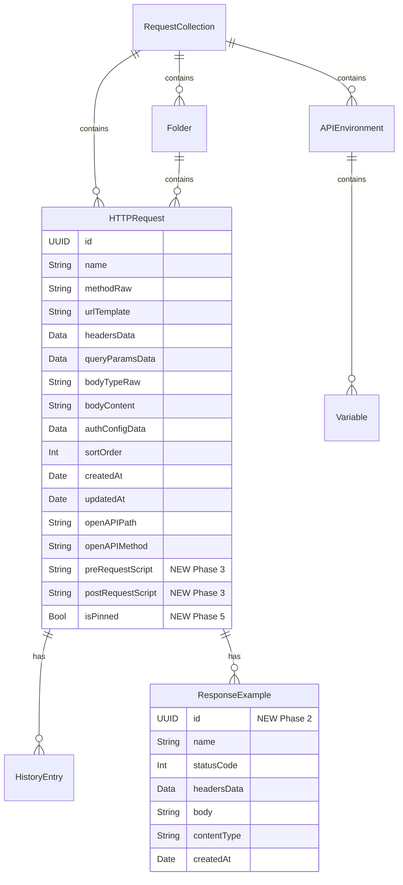

# Next Features: Making Developers Excited About PostKit

## Overview

Six feature groups that transform PostKit from a capable native HTTP client into the API tool every Mac developer recommends. Strategy: **Migration Blitz** — attract users with import, retain with native macOS magic, delight with features Electron apps can never match.

**Target user:** Solo indie/startup developers who value speed, privacy, and native macOS UX.

**Priority order:** Import → Examples → Scripts → iCloud → Menu Bar → Spotlight

## Problem Statement

PostKit has strong fundamentals (native macOS, libcurl timing, Keychain secrets) but lacks the migration path and feature depth to attract developers away from Postman/Insomnia. Three critical gaps:

1. **No import path** — Developers can't bring existing collections, so they don't switch
2. **No scripting** — Auth flows and dynamic requests require pre/post-request scripts
3. **No sync** — Solo devs with multiple Macs need collections everywhere

## Proposed Solution

Deliver six features in phased releases, each building on the last:

| Phase | Feature | Key Deliverable |
|-------|---------|-----------------|
| 1 | Import/Migration | Postman, OpenAPI YAML, Insomnia parsers |
| 2 | Response Examples | Save responses, load from OpenAPI specs |
| 3 | Pre/Post-Request Scripts | JavaScript via JavaScriptCore with `pk.*` API |
| 4 | iCloud Sync | SwiftData + CloudKit, model migration |
| 5 | Menu Bar Quick-Send | `MenuBarExtra` with pinned requests |
| 6 | Spotlight Integration | `CSSearchableIndex` for request search |

## Technical Approach

### Architecture

All new features follow PostKit's established Three-Layer MVVM:

```
View (SwiftUI) → ViewModel (@Observable) → Service (Actor/Class)
     ↓                    ↓
  SwiftData           Keychain
```

**New services** follow the existing pattern:
1. Create protocol in `Services/Protocols/` conforming to `Sendable`
2. Create implementation in `Services/`
3. Register in `DI/Container+Parsers.swift` or `DI/Container+Services.swift`
4. Inject via `@ObservationIgnored @Injected(\.service)` in ViewModels

**New models** follow existing `@Model` patterns:
- `var id: UUID` (removing `@Attribute(.unique)` — see Phase 4 CloudKit prep)
- `@Transient` enum bridging for persisted enums
- `Data?` encoding for `[KeyValuePair]` arrays
- `.cascade` delete rules on parent relationships

### Model Changes (ERD)



### Implementation Phases

---

#### Phase 1: Import/Migration

**Goal:** Remove the #1 adoption barrier — let developers bring their existing work.

##### Phase 1A: Postman Collection v2.1 Import

**New files:**
- `Services/Protocols/PostmanParserProtocol.swift`
- `Services/PostmanParser.swift`
- `Services/PostmanImporter.swift`
- `Views/Import/PostmanImportSheet.swift`

**PostmanParserProtocol** (`Services/Protocols/PostmanParserProtocol.swift`):
```swift
protocol PostmanParserProtocol: Sendable {
    func parse(_ data: Data) throws -> PostmanCollection
}
```

**Data structures** (in `PostmanParser.swift`):
```swift
struct PostmanCollection: Sendable {
    let info: PostmanInfo
    let items: [PostmanItem]
    let variables: [PostmanVariable]
}

struct PostmanInfo: Sendable {
    let name: String
    let schema: String // Must contain "v2.1"
}

struct PostmanItem: Sendable {
    let name: String
    let request: PostmanRequest?     // nil = folder
    let items: [PostmanItem]?        // non-nil = folder with children
    let events: [PostmanEvent]?      // pre-request/test scripts
}

struct PostmanRequest: Sendable {
    let method: String
    let url: PostmanURL
    let headers: [PostmanKeyValue]
    let body: PostmanBody?
    let auth: PostmanAuth?
}

// ... (PostmanURL, PostmanBody, PostmanAuth, PostmanEvent, PostmanVariable)
```

**PostmanParser** implementation:
```swift
final class PostmanParser: PostmanParserProtocol, Sendable {
    func parse(_ data: Data) throws -> PostmanCollection {
        let json = try JSONSerialization.jsonObject(with: data) as? [String: Any]

        // 1. Validate version
        guard let info = json?["info"] as? [String: Any],
              let schema = info["schema"] as? String,
              schema.contains("v2.1") else {
            throw PostmanParserError.unsupportedVersion
        }

        // 2. Parse items recursively (folders + requests)
        // 3. Extract collection-level variables
        // 4. Return structured PostmanCollection
    }
}
```

**PostmanImporter** — maps parsed data to SwiftData models:
- `PostmanItem` (folder) → `Folder`
- `PostmanItem` (request) → `HTTPRequest`
- `PostmanRequest.auth` → `AuthConfig` (encoded as `authConfigData`)
- `PostmanRequest.headers` → `[KeyValuePair]` (encoded as `headersData`)
- `PostmanRequest.url.query` → `[KeyValuePair]` (encoded as `queryParamsData`)
- `PostmanVariable` → `Variable` in new `APIEnvironment`
- `PostmanEvent` scripts → stored as `preRequestScript`/`postRequestScript` on `HTTPRequest` (not executed until Phase 3)

**Import UX flow:**
1. File → Import Postman Collection... (keyboard shortcut: Cmd+Shift+P)
2. File picker: `.json` files
3. Sheet shows: collection name, folder count, request count, script count
4. If scripts found: "N requests have scripts (will be runnable after scripting feature ships)"
5. Confirm → creates `RequestCollection` with full tree
6. Entire import wrapped in single `ModelContext.save()` for atomic rollback

**Postman environment import** (separate file):
1. File → Import Postman Environment...
2. File picker for environment `.json`
3. Maps to `APIEnvironment` with `Variable` entries
4. Prompts user: "Which variables are secrets?" → sets `isSecret = true` for selected

**Error handling:**
```swift
enum PostmanParserError: LocalizedError {
    case unsupportedVersion
    case invalidFormat
    case missingRequiredField(String)

    var errorDescription: String? {
        switch self {
        case .unsupportedVersion:
            return "Only Postman Collection v2.1 format is supported."
        case .invalidFormat:
            return "The file is not a valid Postman collection."
        case .missingRequiredField(let field):
            return "Missing required field: \(field)"
        }
    }
}
```

**DI registration** (`Container+Parsers.swift`):
```swift
nonisolated var postmanParser: Factory<PostmanParserProtocol> {
    self { PostmanParser() }
}
```

**Edge cases:**
- Deeply nested folders (>5 levels) — flatten to 2 levels max (PostKit uses single folder depth)
- Binary body references (`body.file.src`) — skip with warning, store note in body content
- GraphQL bodies — store as raw JSON body with `bodyType = .json`
- Postman global variables — import as collection-level variables (PostKit has no global scope)
- `{{variable}}` syntax — already matches PostKit's interpolation syntax, no conversion needed

##### Phase 1B: OpenAPI YAML Import

**Status:** OpenAPI JSON is already complete. YAML parsing is already implemented via Yams in `OpenAPIParser.swift` (lines 98-105). This is essentially done.

**Verify existing YAML support:**
- Confirm `OpenAPIParser.parse(_:)` handles both JSON and YAML data
- Add explicit YAML file tests if missing
- Update file picker in `OpenAPIImportSheet` to accept `.yaml`/`.yml` content types alongside `.json`

**New ADR entry:** Append ADR-021 documenting Yams as justified dependency (if not already present).

##### Phase 1C: Insomnia Import

**New files:**
- `Services/Protocols/InsomniaParserProtocol.swift`
- `Services/InsomniaParser.swift`
- `Services/InsomniaImporter.swift`

**Insomnia export format:** JSON with `_type` field discriminators:
```json
{
  "_type": "export",
  "__export_format": 4,
  "resources": [
    { "_type": "workspace", "name": "My API", ... },
    { "_type": "request_group", "name": "Auth", "parentId": "wrk_xxx", ... },
    { "_type": "request", "method": "GET", "url": "https://...", "parentId": "fld_xxx", ... },
    { "_type": "environment", "data": { "baseUrl": "https://..." }, ... }
  ]
}
```

**Mapping:**
- `workspace` → `RequestCollection`
- `request_group` → `Folder`
- `request` → `HTTPRequest`
- `environment` → `APIEnvironment` + `Variable` entries

**Lower priority than Postman** — ship after Phase 1A is stable.

##### Phase 1D: Bruno Import (Best-Effort)

**Status:** Deferred. Bruno `.bru` format is evolving. Best-effort support if time permits.

**Pattern:** Parse `.bru` plain-text files with regex/line-by-line parser. Each `.bru` file = one request.

---

##### Phase 1 Tests

All tests in `PostKitTests/PostKitTests.swift` with `// MARK:` separators.

```swift
// MARK: - PostmanParser Tests
@Suite(.container)
struct PostmanParserTests {
    let parser = PostmanParser()

    // Positive
    @Test func parseSimpleCollection() throws { ... }
    @Test func parseNestedFolders() throws { ... }
    @Test func parseWithAuth() throws { ... }
    @Test func parseWithEnvironmentVariables() throws { ... }
    @Test func parseWithPreRequestScript() throws { ... }

    // Negative
    @Test func rejectV1Format() throws { ... }
    @Test func rejectInvalidJSON() throws { ... }
    @Test func handleMissingOptionalFields() throws { ... }

    // Edge cases
    @Test func flattenDeeplyNestedFolders() throws { ... }
    @Test func handleBinaryBodyReference() throws { ... }
    @Test func handleGraphQLBody() throws { ... }
    @Test func preserveVariableSyntax() throws { ... }
}

// MARK: - PostmanImporter Tests
@Suite(.container)
struct PostmanImporterTests {
    @Test func importCreatesCollectionWithFolders() async throws { ... }
    @Test func importMapsAuthCorrectly() async throws { ... }
    @Test func importRollsBackOnError() async throws { ... }
    @Test func importHandlesNameConflict() async throws { ... }
}

// MARK: - InsomniaParser Tests
@Suite(.container)
struct InsomniaParserTests {
    let parser = InsomniaParser()

    @Test func parseExportFormat4() throws { ... }
    @Test func parseWithEnvironments() throws { ... }
    @Test func rejectUnsupportedFormat() throws { ... }
}
```

**Mock:**
```swift
// PostKitTests/Mocks/MockPostmanParser.swift
final class MockPostmanParser: PostmanParserProtocol, Sendable {
    var collectionToReturn: PostmanCollection?
    var errorToThrow: Error?

    func parse(_ data: Data) throws -> PostmanCollection {
        if let error = errorToThrow { throw error }
        return collectionToReturn!
    }
}
```

---

#### Phase 2: Response Examples

**Goal:** Save responses as named examples, load examples from OpenAPI specs.

##### New Model: ResponseExample

**New file:** `Models/ResponseExample.swift`
```swift
@Model
final class ResponseExample {
    var id: UUID
    var name: String
    var statusCode: Int
    var headersData: Data?       // KeyValuePair encoded (reuses existing pattern)
    var body: String?            // Text-based only (MVP), max 10MB enforced at save time
    var contentType: String?
    var createdAt: Date

    var request: HTTPRequest?    // Parent relationship

    init(name: String, statusCode: Int, contentType: String? = nil, body: String? = nil) {
        self.id = UUID()
        self.name = name
        self.statusCode = statusCode
        self.contentType = contentType
        self.body = body
        self.createdAt = Date()
    }
}
```

**Note:** `id` has no `@Attribute(.unique)` — designed for CloudKit compatibility from day one (Phase 4).

**HTTPRequest relationship** (add to `HTTPRequest.swift`):
```swift
@Relationship(deleteRule: .cascade, inverse: \ResponseExample.request)
var examples: [ResponseExample] = []
```

**Register in schema** (`PostKitApp.swift` line 64):
```swift
let schema = Schema([
    RequestCollection.self,
    Folder.self,
    HTTPRequest.self,
    APIEnvironment.self,
    Variable.self,
    HistoryEntry.self,
    ResponseExample.self  // NEW
])
```

##### Save Response as Example

**Location:** Response viewer pane — new "Save as Example" button next to existing copy button.

**Flow:**
1. User sends request, sees response
2. Clicks "Save as Example"
3. Alert prompts for name (default: `"{statusCode} {method} {path}"`, e.g. "200 GET /users")
4. Validates body size (reject >10MB with error: "Response too large to save as example")
5. Creates `ResponseExample` with response body, headers, status code, content type
6. Links to current `HTTPRequest` via relationship

**Size limit constant:**
```swift
// In ResponseExample or a shared constants location
static let maxExampleBodySize = 10 * 1024 * 1024 // 10MB
```

##### View Examples

**Location:** New "Examples" tab in `ResponseTab` enum.

**Update `ResponseTab`** (`RequestViewModel.swift`):
```swift
enum ResponseTab: String, CaseIterable {
    case body = "Body"
    case headers = "Headers"
    case timing = "Timing"
    case examples = "Examples"  // NEW
}
```

**Examples tab shows:**
- List of saved examples (name, status code badge, date)
- Click example → loads body in response viewer (read-only mode)
- Delete button per example (swipe-to-delete or context menu)
- "Viewing Example" banner distinguishes from live response
- Empty state: `ContentUnavailableView("No Examples", ...)`

##### OpenAPI Example Loading

**Enhancement to existing `OpenAPIParser`:**

When parsing `responses.{statusCode}.content.{mediaType}.example` or `examples`:
1. Extract example value (inline JSON/XML/text)
2. Create `ResponseExample` during import:
   - `name`: `"{statusCode} {summary or operationId}"` — e.g., "200 List Users"
   - Collision handling: append `" (2)"` suffix if duplicate name on same request
   - `statusCode`: parsed from response key
   - `body`: serialized example value
   - `contentType`: from media type key

**Enhancement to `OpenAPIImporter`:**
```swift
// After creating HTTPRequest, check for response examples
for (statusCode, responseSpec) in endpoint.responses {
    for (mediaType, content) in responseSpec.content {
        if let example = content.example {
            let exampleModel = ResponseExample(
                name: "\(statusCode) \(endpoint.summary ?? endpoint.operationId ?? "")",
                statusCode: Int(statusCode) ?? 0,
                contentType: mediaType,
                body: serializeExample(example)
            )
            exampleModel.request = httpRequest
            context.insert(exampleModel)
        }
    }
}
```

##### Phase 2 Tests

```swift
// MARK: - ResponseExample Tests
@Suite(.container)
struct ResponseExampleTests {
    @Test func saveExampleFromResponse() async throws { ... }
    @Test func rejectOversizedBody() throws { ... }
    @Test func cascadeDeleteWithRequest() async throws { ... }
    @Test func openAPIImportCreatesExamples() async throws { ... }
    @Test func exampleNameCollisionHandling() throws { ... }
    @Test func decodeHeadersFromData() throws { ... }
}
```

---

#### Phase 3: Pre/Post-Request Scripts

**Goal:** JavaScript scripting via JavaScriptCore with Postman-compatible `pk.*` API.

##### Model Changes

**Add to `HTTPRequest.swift`:**
```swift
var preRequestScript: String?
var postRequestScript: String?
```

**Update `HTTPRequest.duplicated()`** to copy scripts:
```swift
copy.preRequestScript = preRequestScript
copy.postRequestScript = postRequestScript
```

##### JavaScriptEngine Service

**New files:**
- `Services/Protocols/ScriptEngineProtocol.swift`
- `Services/JavaScriptEngine.swift`

**Protocol:**
```swift
protocol ScriptEngineProtocol: Sendable {
    func executePreRequest(
        script: String,
        request: ScriptRequest,
        environment: [String: String]
    ) async throws -> ScriptPreRequestResult

    func executePostRequest(
        script: String,
        response: ScriptResponse,
        environment: [String: String]
    ) async throws -> ScriptPostRequestResult
}
```

**Result types:**
```swift
struct ScriptPreRequestResult: Sendable {
    let modifiedHeaders: [String: String]?   // Headers added/modified by script
    let modifiedURL: String?                  // URL changed by script
    let modifiedBody: String?                 // Body changed by script
    let environmentChanges: [String: String]  // pk.environment.set() calls
    let consoleOutput: [String]               // console.log() output
}

struct ScriptPostRequestResult: Sendable {
    let environmentChanges: [String: String]  // pk.environment.set() calls
    let consoleOutput: [String]               // console.log() output
}
```

**JavaScriptEngine implementation:**
```swift
import JavaScriptCore

final class JavaScriptEngine: ScriptEngineProtocol, Sendable {

    // Script timeout: 5 seconds
    private static let timeout: TimeInterval = 5.0

    func executePreRequest(
        script: String,
        request: ScriptRequest,
        environment: [String: String]
    ) async throws -> ScriptPreRequestResult {
        let context = JSContext()!

        // 1. Inject pk.* API
        setupPKNamespace(context, request: request, environment: environment)

        // 2. Inject pm.* shim (auto-maps to pk.*)
        setupPMShim(context)

        // 3. Capture console.log output
        let consoleOutput = setupConsole(context)

        // 4. Execute with timeout
        let result = try await withTimeout(Self.timeout) {
            context.evaluateScript(script)
        }

        // 5. Extract modifications
        return ScriptPreRequestResult(...)
    }
}
```

**`pk.*` MVP API surface:**

```javascript
// Pre-request context
pk.environment.get(key)           // Read environment variable
pk.environment.set(key, value)    // Set environment variable (persists to SwiftData)
pk.variables.get(key)             // Read collection variable (read-only)
pk.request.url                    // Current URL (read/write)
pk.request.method                 // Current method (read-only)
pk.request.headers.get(key)       // Get header value
pk.request.headers.add({key, value}) // Add header
pk.request.headers.remove(key)    // Remove header
pk.request.body                   // Current body (read/write for pre-request)

// Post-request context (adds response, keeps environment)
pk.response.code                  // HTTP status code
pk.response.json()                // Parse body as JSON
pk.response.text()                // Raw body text
pk.response.headers.get(key)      // Response header value
pk.response.responseTime          // Duration in ms
```

**Deferred (post-MVP):**
- `pk.test()` — test assertions / test runner
- `pk.sendRequest()` — execute requests from within scripts
- `pk.cookies` — cookie jar integration
- `pk.require()` — external library loading

**`pm.*` auto-mapping shim:**
```javascript
// Injected before user script
var pm = pk;  // Simple alias — pm.environment.get() → pk.environment.get()
```

**Security sandbox:**
- JavaScriptCore runs without network or filesystem access by default
- No `XMLHttpRequest`, `fetch()`, `WebSocket`, `importScripts()` available
- `eval()` is available in JSCore (needed for JSON parsing in scripts) — acceptable risk since scripts are user-authored
- Timeout prevents infinite loops (5 seconds, configurable)
- No access to Swift objects beyond the explicitly injected `pk.*` API

##### ViewModel Integration

**Modify `RequestViewModel.sendRequest()`** (`RequestViewModel.swift`):

```swift
// In sendRequest(), between buildURLRequest and httpClient.execute:

// Pre-request script execution
if let script = request.preRequestScript, !script.isEmpty {
    let scriptRequest = ScriptRequest(from: urlRequest)
    let variables = getActiveEnvironmentVariables()
    let result = try await scriptEngine.executePreRequest(
        script: script,
        request: scriptRequest,
        environment: variables
    )
    applyScriptResult(result, to: &urlRequest)
    persistEnvironmentChanges(result.environmentChanges)
    self.scriptConsoleOutput = result.consoleOutput
}

// ... execute request ...

// Post-request script execution
if let script = request.postRequestScript, !script.isEmpty {
    let scriptResponse = ScriptResponse(from: httpResponse)
    let variables = getActiveEnvironmentVariables()
    let result = try await scriptEngine.executePostRequest(
        script: script,
        response: scriptResponse,
        environment: variables
    )
    persistEnvironmentChanges(result.environmentChanges)
    self.scriptConsoleOutput += result.consoleOutput
}
```

**New ViewModel state:**
```swift
var scriptConsoleOutput: [String] = []
```

**New dependency:**
```swift
@ObservationIgnored @Injected(\.scriptEngine) private var scriptEngine
```

##### Script Editor UI

**Location:** New tabs in request editor (alongside Body/Headers/Auth).

- "Pre-request" tab → `CodeTextView` with JavaScript syntax highlighting
- "Post-request" tab → `CodeTextView` with JavaScript syntax highlighting
- "Console" tab in response viewer → shows `scriptConsoleOutput` lines

Reuse existing `CodeTextView` component (Highlightr already supports JavaScript).

##### DI Registration

```swift
// Container+Services.swift
nonisolated var scriptEngine: Factory<ScriptEngineProtocol> {
    self { JavaScriptEngine() }
}
```

##### Phase 3 Tests

```swift
// MARK: - JavaScriptEngine Tests
@Suite(.container)
struct JavaScriptEngineTests {
    let engine = JavaScriptEngine()

    // Pre-request
    @Test func preRequestSetsEnvironmentVariable() async throws { ... }
    @Test func preRequestAddsHeader() async throws { ... }
    @Test func preRequestModifiesURL() async throws { ... }
    @Test func preRequestTimesOutAfter5Seconds() async throws { ... }

    // Post-request
    @Test func postRequestReadsStatusCode() async throws { ... }
    @Test func postRequestParsesJSON() async throws { ... }
    @Test func postRequestSetsEnvironmentVariable() async throws { ... }

    // pm.* compatibility
    @Test func pmShimMapsToPackNamespace() async throws { ... }
    @Test func pmEnvironmentSetMapsToPk() async throws { ... }

    // Error handling
    @Test func syntaxErrorReportsLineNumber() async throws { ... }
    @Test func runtimeErrorCaptured() async throws { ... }
    @Test func consoleLogCaptured() async throws { ... }

    // Security
    @Test func noNetworkAccess() async throws { ... }
    @Test func noFileSystemAccess() async throws { ... }
}
```

**Mock:**
```swift
// PostKitTests/Mocks/MockScriptEngine.swift
final class MockScriptEngine: ScriptEngineProtocol, Sendable {
    var preRequestResult: ScriptPreRequestResult?
    var postRequestResult: ScriptPostRequestResult?
    var errorToThrow: Error?

    func executePreRequest(...) async throws -> ScriptPreRequestResult { ... }
    func executePostRequest(...) async throws -> ScriptPostRequestResult { ... }
}
```

---

#### Phase 4: iCloud Sync

**Goal:** Sync collections across Macs via SwiftData + CloudKit. No account setup required.

##### Model Migration (CloudKit Compatibility)

**CRITICAL BREAKING CHANGE:** Remove `@Attribute(.unique)` from all models.

CloudKit requires:
- No `@Attribute(.unique)` constraints
- All relationships effectively optional (array relationships with `= []` defaults are fine)
- All properties have default values

**Changes across all 7 model files:**

| Model | Change |
|-------|--------|
| `HTTPRequest.swift:6` | `@Attribute(.unique) var id: UUID` → `var id: UUID` |
| `HistoryEntry.swift:6` | `@Attribute(.unique) var id: UUID` → `var id: UUID` |
| `RequestCollection.swift:6` | `@Attribute(.unique) var id: UUID` → `var id: UUID` |
| `Folder.swift:6` | `@Attribute(.unique) var id: UUID` → `var id: UUID` |
| `APIEnvironment.swift:6` | `@Attribute(.unique) var id: UUID` → `var id: UUID` |
| `Variable.swift:10` | `@Attribute(.unique) var id: UUID` → `var id: UUID` |
| `ResponseExample.swift` (new) | Already designed without `.unique` |

**Migration strategy:** SwiftData lightweight migration handles attribute removal automatically. No `VersionedSchema` needed for this change (removing constraints is backward-compatible).

**Risk mitigation:** UUID collision is astronomically unlikely (1 in 2^122) — app-layer uniqueness check is unnecessary.

##### ModelContainer Configuration

**Update `PostKitApp.swift`:**

```swift
var sharedModelContainer: ModelContainer = {
    let schema = Schema([
        RequestCollection.self,
        Folder.self,
        HTTPRequest.self,
        APIEnvironment.self,
        Variable.self,
        HistoryEntry.self,
        ResponseExample.self
    ])

    // Main configuration: syncs to iCloud
    let cloudConfig = ModelConfiguration(
        "PostKit",
        schema: schema,
        cloudKitDatabase: .automatic
    )

    do {
        return try ModelContainer(for: schema, configurations: [cloudConfig])
    } catch {
        fatalError("Could not create ModelContainer: \(error)")
    }
}()
```

**History exclusion strategy:**

History entries sync by default (they're in the same schema). To exclude them, we have two options:

- **Option A (simple):** Accept that history syncs. It's small per-entry (no response bodies stored), and solo devs benefit from seeing history across devices.
- **Option B (complex):** Use separate `ModelConfiguration` for `HistoryEntry` with `cloudKitDatabase: .none`. Requires splitting the schema and careful relationship handling.

**Recommendation:** Option A — let history sync. Each `HistoryEntry` is ~200 bytes. 1000 entries = ~200KB. Negligible CloudKit usage.

##### Sync UI

**New state on `PostKitApp` or a `SyncStatusViewModel`:**
```swift
@Observable
final class SyncStatusViewModel {
    var syncState: SyncState = .idle

    enum SyncState {
        case idle
        case syncing
        case synced
        case error(String)
    }
}
```

**UI indicator:** Small cloud icon in sidebar footer:
- Cloud icon = synced
- Cloud with arrow = syncing
- Cloud with X = error (tap for details)
- No icon = iCloud disabled

##### Keychain Behavior

Secrets do NOT sync (by design):
- `Variable.secureValue` stores in Keychain with `kSecAttrAccessibleWhenUnlockedThisDeviceOnly`
- On a new device, `Variable.isSecret == true` but Keychain has no value → `secureValue` returns empty `value` field
- UI shows warning icon next to secret variables that have empty values: "Secret value not set on this device"
- User re-enters secrets per-device (security-first approach)

##### iCloud Account Handling

```swift
// Check iCloud availability at launch
if FileManager.default.ubiquityIdentityToken == nil {
    // iCloud not available — show banner: "Sign in to iCloud to sync collections"
    // App works fully offline, just doesn't sync
}
```

##### Phase 4 Tests

```swift
// MARK: - CloudKit Compatibility Tests
@Suite(.container)
struct CloudKitCompatibilityTests {
    // Verify no @Attribute(.unique) on any model
    @Test func modelsHaveNoUniqueConstraint() throws { ... }

    // Verify all relationships are optional or have defaults
    @Test func relationshipsAreCloudKitCompatible() throws { ... }

    // Verify model container can be created with CloudKit config
    @Test func cloudKitContainerCreation() throws { ... }
}

// MARK: - Sync Status Tests
@Suite(.container)
struct SyncStatusTests {
    @Test func syncStateTransitions() { ... }
    @Test func secretVariablesShowWarningOnNewDevice() { ... }
}
```

---

#### Phase 5: Menu Bar Quick-Send

**Goal:** Pin favorite requests, send with one click from the menu bar.

##### Model Changes

**Add to `HTTPRequest.swift`:**
```swift
var isPinned: Bool = false
```

**Update `HTTPRequest.duplicated()`:**
```swift
// isPinned intentionally NOT copied — duplicated request starts unpinned
```

##### MenuBarExtra Scene

**Update `PostKitApp.swift` body:**
```swift
var body: some Scene {
    WindowGroup { ... }
        .modelContainer(sharedModelContainer)
        .commands { ... }

    MenuBarExtra("PostKit", systemImage: "network") {
        MenuBarView()
    }
    .menuBarExtraStyle(.menu)
    .modelContainer(sharedModelContainer)
}
```

##### MenuBarView

**New file:** `Views/MenuBar/MenuBarView.swift`

```swift
struct MenuBarView: View {
    @Query(filter: #Predicate<HTTPRequest> { $0.isPinned })
    private var pinnedRequests: [HTTPRequest]

    @Environment(\.modelContext) private var modelContext
    @State private var results: [UUID: MenuBarResult] = [:]

    var body: some View {
        if pinnedRequests.isEmpty {
            Text("No Pinned Requests")
                .foregroundStyle(.secondary)
            Divider()
        } else {
            ForEach(pinnedRequests.prefix(20)) { request in
                MenuBarRequestRow(
                    request: request,
                    result: results[request.id]
                ) {
                    await sendRequest(request)
                }
            }
            Divider()
        }

        Button("Open PostKit") {
            NSApp.activate(ignoringOtherApps: true)
        }
        .keyboardShortcut("o")

        Divider()

        Button("Quit PostKit") {
            NSApplication.shared.terminate(nil)
        }
        .keyboardShortcut("q")
    }
}
```

**Request execution in menu bar context:**
- Uses active environment (queried from SwiftData: `APIEnvironment` where `isActive == true`)
- Variable interpolation applied via `VariableInterpolator`
- Auth applied from `HTTPRequest.authConfig`
- Pre-request scripts: **skip in menu bar** — show "(has script)" indicator, user must open main app for scripted requests
- Creates `HistoryEntry` on completion (same as main app)

**Pin limit:** 20 requests max. If >20 pinned, show most recently pinned 20.

##### Pin/Unpin UI

**In main app request context menu:**
```swift
// RequestRow context menu addition
Button(request.isPinned ? "Unpin from Menu Bar" : "Pin to Menu Bar") {
    request.isPinned.toggle()
}
```

##### Phase 5 Tests

```swift
// MARK: - Menu Bar Tests
@Suite(.container)
struct MenuBarTests {
    @Test func pinnedRequestsQuery() async throws { ... }
    @Test func sendFromMenuBarCreatesHistory() async throws { ... }
    @Test func unpinnedRequestNotInMenuBar() async throws { ... }
    @Test func pinLimitEnforced() async throws { ... }
    @Test func scriptedRequestSkippedInMenuBar() async throws { ... }
}
```

---

#### Phase 6: Spotlight Integration

**Goal:** Search any request from macOS Spotlight.

##### SpotlightIndexer Service

**New files:**
- `Services/Protocols/SpotlightIndexerProtocol.swift`
- `Services/SpotlightIndexer.swift`

**Protocol:**
```swift
import CoreSpotlight

protocol SpotlightIndexerProtocol: Sendable {
    func indexRequest(_ request: HTTPRequest, collectionName: String?, folderName: String?) async
    func deindexRequest(id: UUID) async
    func deindexRequests(ids: [UUID]) async
    func reindexAll(requests: [HTTPRequest]) async
}
```

**Implementation:**
```swift
import CoreSpotlight
import MobileCoreServices

final class SpotlightIndexer: SpotlightIndexerProtocol, Sendable {

    func indexRequest(_ request: HTTPRequest, collectionName: String?, folderName: String?) async {
        let attributeSet = CSSearchableItemAttributeSet(contentType: .item)
        attributeSet.title = request.name
        attributeSet.contentDescription = "\(request.method.rawValue) \(request.urlTemplate)"
        attributeSet.keywords = [
            request.method.rawValue,
            collectionName,
            folderName
        ].compactMap { $0 }

        // Pre-rendered method badge thumbnail (cached)
        attributeSet.thumbnailData = MethodBadgeRenderer.render(request.method)

        let item = CSSearchableItem(
            uniqueIdentifier: request.id.uuidString,
            domainIdentifier: "dev.adryanev.PostKit.requests",
            attributeSet: attributeSet
        )

        try? await CSSearchableIndex.default().indexSearchableItems([item])
    }

    func deindexRequest(id: UUID) async {
        try? await CSSearchableIndex.default().deleteSearchableItems(
            withIdentifiers: [id.uuidString]
        )
    }

    func deindexRequests(ids: [UUID]) async {
        try? await CSSearchableIndex.default().deleteSearchableItems(
            withIdentifiers: ids.map(\.uuidString)
        )
    }

    func reindexAll(requests: [HTTPRequest]) async {
        // Full re-index on app launch if needed
        try? await CSSearchableIndex.default().deleteAllSearchableItems()
        for request in requests {
            await indexRequest(request, collectionName: request.collection?.name, folderName: request.folder?.name)
        }
    }
}
```

##### Index Lifecycle

**When to index:**
- Request created → `indexRequest()`
- Request renamed/URL changed → `indexRequest()` (overwrites by same identifier)
- Request deleted → `deindexRequest()`
- Collection deleted (cascade) → `deindexRequests(ids:)` for all child request IDs

**Debouncing:** Index updates fire on `ModelContext.save()`, not on every keystroke. SwiftData saves are already debounced by the framework.

**Full re-index:** On app launch, if Spotlight index appears stale (e.g., first launch after update).

##### Deep Linking

**Handle Spotlight result click** (`PostKitApp.swift`):

```swift
WindowGroup {
    ContentView()
        .onContinueUserActivity(CSSearchableItemActionType) { userActivity in
            if let identifier = userActivity.userInfo?[CSSearchableItemActivityIdentifier] as? String,
               let uuid = UUID(uuidString: identifier) {
                navigateToRequest(uuid)
            }
        }
}
```

**Navigation:** Set sidebar selection to the request's collection, then select the request in the list.

##### DI Registration

```swift
// Container+Services.swift
nonisolated var spotlightIndexer: Factory<SpotlightIndexerProtocol> {
    self { SpotlightIndexer() }.singleton
}
```

##### Phase 6 Tests

```swift
// MARK: - SpotlightIndexer Tests
@Suite(.container)
struct SpotlightIndexerTests {
    @Test func indexRequestCreatesSearchableItem() async throws { ... }
    @Test func deindexRemovesFromIndex() async throws { ... }
    @Test func batchDeindexOnCascadeDelete() async throws { ... }
    @Test func reindexAllReplacesExistingIndex() async throws { ... }
    @Test func deepLinkNavigatesToRequest() async throws { ... }
}
```

---

## Alternative Approaches Considered

### Import

**Alternative: Use third-party Postman parser library**
- Rejected: Would add a dependency for something achievable with JSONSerialization. Postman's format is JSON, not complex enough to warrant a library. Aligns with ADR-003 minimal dependencies.

**Alternative: Import via clipboard paste (not file picker)**
- Rejected: File picker is the standard import UX. Clipboard paste could be added later as a convenience.

### Scripts

**Alternative: Swift scripting instead of JavaScript**
- Rejected: No built-in Swift interpreter. Would require embedding Swift compiler or using a third-party scripting engine. JavaScriptCore is built into macOS with zero dependencies.

**Alternative: Visual/no-code script builder**
- Rejected: Too limited for power users. Can be added later as a complement to JavaScript.

### iCloud Sync

**Alternative: Git-based sync (like Bruno)**
- Rejected: Requires users to understand Git. PostKit targets solo devs who want "it just works" sync. iCloud is invisible.

**Alternative: Custom server sync**
- Rejected: Requires server infrastructure, accounts, and ongoing costs. iCloud is free, private, and Apple-managed.

### Menu Bar

**Alternative: Separate helper app process**
- Rejected: Adds complexity (XPC, separate target, code signing). Main app process with `MenuBarExtra` is simpler and sufficient for solo devs. Menu bar requires PostKit to be running (can be hidden in dock).

## Acceptance Criteria

### Functional Requirements

#### Import (Phase 1)
- [x] Postman Collection v2.1 JSON file imports correctly with folders, requests, headers, auth, and variables
- [x] Postman v2.1 format validated; unsupported versions show clear error
- [x] Postman environments import as `APIEnvironment` with `Variable` entries
- [x] Imported Postman scripts stored on `HTTPRequest.preRequestScript`/`postRequestScript`
- [x] OpenAPI YAML files parse correctly via existing `OpenAPIParser`
- [ ] Insomnia export format 4 JSON imports correctly
- [ ] Import is atomic — failure rolls back entirely (no partial imports)
- [ ] Name collision on import prompts user: Merge, Replace, or Rename

#### Examples (Phase 2)
- [ ] "Save as Example" creates `ResponseExample` linked to current `HTTPRequest`
- [ ] Examples tab lists all saved examples with status code badges
- [ ] Viewing example loads body in read-only mode with "Viewing Example" banner
- [ ] OpenAPI import creates `ResponseExample` entries from spec examples
- [ ] Responses >10MB cannot be saved as examples (clear error message)
- [ ] Deleting a request cascade-deletes its examples

#### Scripts (Phase 3)
- [ ] Pre-request script modifies headers, URL, and body before send
- [ ] Post-request script reads response and sets environment variables
- [ ] `pk.environment.set()` persists to SwiftData
- [ ] `pm.*` calls auto-map to `pk.*` equivalents
- [ ] Script errors show line number and message in Console tab
- [ ] Scripts timeout after 5 seconds with clear error
- [ ] `console.log()` output appears in Console tab
- [ ] Script editor uses CodeTextView with JavaScript syntax highlighting

#### iCloud Sync (Phase 4)
- [ ] Collections, folders, requests, environments, variables, and examples sync across devices
- [ ] `@Attribute(.unique)` removed from all models without data loss
- [ ] Keychain secrets do NOT appear in CloudKit (verified)
- [ ] Sync status indicator shows in sidebar (syncing/synced/error)
- [ ] App works fully offline when iCloud unavailable
- [ ] Secret variables show "not set on this device" warning on new devices

#### Menu Bar (Phase 5)
- [ ] Right-click request → "Pin to Menu Bar" toggles `isPinned`
- [ ] Menu bar shows pinned requests with method + name
- [ ] Clicking pinned request sends immediately, shows status + response time
- [ ] "Open PostKit" opens main app window
- [ ] Requests with scripts show indicator, not executed from menu bar
- [ ] Menu bar sends create `HistoryEntry` records
- [ ] Max 20 pinned requests displayed

#### Spotlight (Phase 6)
- [ ] Requests appear in Spotlight search by name, URL, method, or collection
- [ ] Clicking Spotlight result opens PostKit and navigates to request
- [ ] Deleted requests removed from Spotlight index
- [ ] Cascade-deleted requests batch-removed from index
- [ ] Full re-index available on app launch

### Non-Functional Requirements

- [ ] All new services conform to `Sendable`
- [ ] All `@Injected` properties in `@Observable` classes marked `@ObservationIgnored`
- [ ] All new models registered in `PostKitApp.swift` schema array
- [ ] All new services registered in `DI/Container+*.swift`
- [ ] Import of 100 requests completes in <5 seconds
- [ ] Script execution times out after 5 seconds
- [ ] No network or filesystem access from script sandbox

### Quality Gates

- [ ] Tests with positive, negative, and edge cases for each new parser/service
- [ ] Mocks created for all new protocols (for ViewModel testing)
- [ ] All tests pass: `cd PostKit && xcodebuild test -scheme PostKit -destination 'platform=macOS'`
- [ ] ADR updated for new dependencies (Yams if not already documented)

## Dependencies & Prerequisites

| Phase | Dependency | Status |
|-------|-----------|--------|
| 1B | Yams Swift package | Already in project (used by OpenAPIParser) |
| 2 | Phase 1 OpenAPI parser enhancement | Can run in parallel |
| 3 | Phase 1 Postman import (script storage fields) | Sequential |
| 4 | All previous phases (model changes must be cumulative) | Sequential |
| 5 | Phase 4 (synced pinned state) | Sequential |
| 6 | No dependencies | Can run in parallel with Phase 5 |

**Parallelization opportunities:**
- Phase 1A (Postman) and Phase 2 (Examples) can run in parallel
- Phase 5 (Menu Bar) and Phase 6 (Spotlight) can run in parallel

## Risk Analysis & Mitigation

| Risk | Severity | Mitigation |
|------|----------|------------|
| CloudKit model migration fails | HIGH | Test on fresh install + existing database. Lightweight migration handles attribute removal. Keep backup of `.sqlite` before migration. |
| Postman format edge cases | MEDIUM | Start with well-known collections from Postman's public workspace. Add edge case tests incrementally. |
| Script sandbox escape | MEDIUM | JavaScriptCore's default sandbox is strong. No network/filesystem APIs exposed. Timeout prevents DoS. |
| iCloud conflict loses data | LOW | Last-writer-wins is acceptable for solo devs. Add passive notification banner when sync conflict resolves. |
| Spotlight index corruption | LOW | Full re-index on app launch as fallback. `CSSearchableIndex` is robust. |
| Menu bar data freshness | LOW | `MenuBarExtra` shares `ModelContainer` with main app — always fresh. |

## Future Considerations

These are explicitly **not in scope** but informed the architecture:

- **GraphQL support** — Would add a new body type and query editor. Current architecture supports this.
- **WebSocket support** — Would require a new `WebSocketClient` service alongside `HTTPClientProtocol`.
- **Request chaining** — `{{response.body.token}}` syntax could extend `VariableInterpolator`.
- **Code generation** — "Copy as Swift/Python/JS" could be a new `CodeGenerator` service.
- **Shortcuts app integration** — `AppIntent` conformances for requests and collections.
- **`pk.test()` assertions** — Full test runner deferred from scripting MVP.

## Documentation Plan

- [ ] Append ADR-021: Yams dependency justification (if missing)
- [ ] Append ADR-022: JavaScriptCore for scripting (zero-dependency, built-in)
- [ ] Append ADR-023: iCloud sync via SwiftData + CloudKit
- [ ] Update `CLAUDE.md` with new model (`ResponseExample`), new services, and new DI registrations
- [ ] Update `docs/sop/developer-guide.md` with import, scripting, and sync sections

## References & Research

### Internal References

- Architecture decisions: `docs/adr/0001-postkit-architecture-decisions.md`
- Brainstorm: `docs/brainstorms/2026-02-16-next-features-developer-excitement-brainstorm.md`
- SwiftData best practices: `docs/SwiftData-Best-Practices-2025.md` (lines 1111-1241 for CloudKit)
- Factory DI infinite re-render fix: `docs/solutions/integration-issues/infinite-rerender-factory-di-20260214.md`
- Existing parser pattern: `PostKit/PostKit/Services/CurlParser.swift`
- Existing importer pattern: `PostKit/PostKit/Services/OpenAPIImporter.swift`
- DI container: `PostKit/PostKit/DI/Container+Parsers.swift`, `Container+Services.swift`
- ViewModel hook points: `PostKit/PostKit/ViewModels/RequestViewModel.swift:61-68` (pre/post script hooks)
- App entry: `PostKit/PostKit/PostKitApp.swift:63-79` (ModelContainer config)
- Model files: `PostKit/PostKit/Models/*.swift` (all 6 models with `@Attribute(.unique)`)

### External References

- [Postman Collection v2.1 Schema](https://schema.postman.com/collection/json/v2.1.0/draft-07/collection.json)
- [Insomnia Export Format](https://docs.insomnia.rest/insomnia/import-export-data)
- [Apple JavaScriptCore Documentation](https://developer.apple.com/documentation/javascriptcore)
- [Apple CSSearchableIndex Documentation](https://developer.apple.com/documentation/corespotlight/cssearchableindex)
- [Apple MenuBarExtra Documentation](https://developer.apple.com/documentation/swiftui/menubarextra)
- [SwiftData CloudKit Integration](https://developer.apple.com/documentation/swiftdata/syncing-model-data-across-a-persons-devices)
