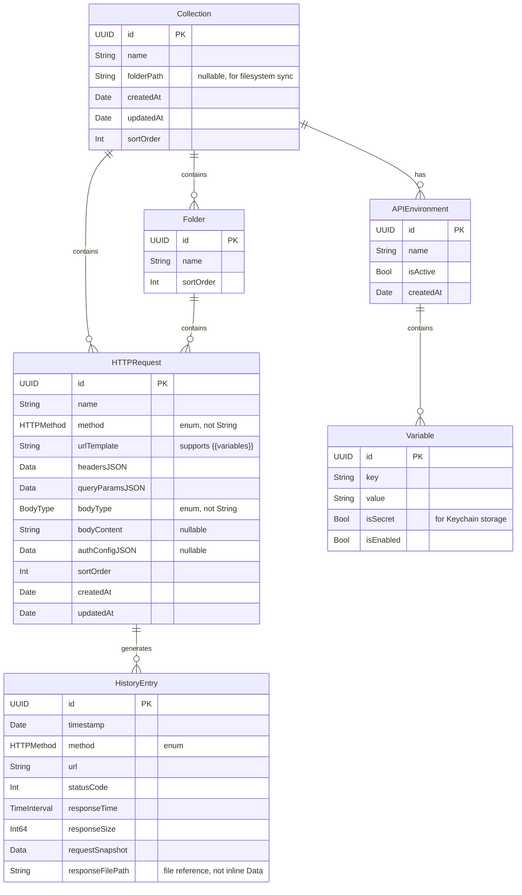

# feat: PostKit MVP Architecture

**Date:** 2026-01-06
**Type:** Enhancement
**Detail Level:** More (Standard)
**Enhanced:** 2026-01-06 (via /deepen-plan with 13 parallel research agents)
**Further Enhanced:** 2026-02-13 (additional research pass)

---

## Enhancement Summary

This plan was enhanced with insights from 13 specialized research and review agents:

### Critical Issues Identified

| Severity | Issue | Section |
|----------|-------|---------|
| 🔴 Critical | `session.invalidateAndCancel()` destroys HTTPClient permanently | HTTPClient Service |
| 🔴 Critical | Variable interpolation SSRF risk - no URL validation | VariableInterpolator |
| 🔴 Critical | Missing `.cascade` delete rules cause orphaned records | SwiftData Schema |
| 🔴 Critical | History stores potentially sensitive response data unencrypted | Security |
| 🟠 High | `Environment` model name conflicts with `SwiftUI.Environment` | Naming |
| 🟠 High | String-based enums lose type safety and autocomplete | Data Models |
| 🟠 High | No pagination for 500+ requests causes SwiftData performance issues | Performance |
| 🟠 High | 10MB response cap stored in memory - use streaming | Performance |
| 🟡 Medium | ViewModel layer may be over-engineered for SwiftUI + @Observable | Architecture |
| 🟡 Medium | Dual-parent (Collection OR Folder) creates ambiguity | Data Integrity |

### Key Recommendations Applied

1. **Rename `Environment` → `APIEnvironment`** to avoid SwiftUI conflict
2. **Use proper Swift enums** for HTTPMethod, BodyType, AuthType
3. **Add protocol abstractions** for testability (HTTPClientProtocol)
4. **Fix HTTPClient cancellation** - use task-based, not session invalidation
5. **Add SSRF protection** to variable interpolation
6. **Implement lazy loading** for large collections
7. **Stream large responses** to disk instead of memory
8. **Add explicit delete rules** to all relationships
9. **Encrypt sensitive history data** or exclude from storage

### Additional Research from 2026-02-13 Pass

**SwiftData Enhancements:**
- Use `includePendingChanges` flag in FetchDescriptor for real-time sync control
- Consider `ModelActor` for background context operations on large datasets
- `@Query` with explicit sort descriptors enables optimal indexing

**SwiftUI/WWDC25 Updates:**
- `@Observable` macro patterns for custom state management
- SwiftUI MainActor defaults - use strategically, not on entire classes
- `NavigationSplitView` `preferredCompactColumn` for better macOS UX control

**Security Enhancements:**
- Keychain `kSecAttrAccessibleWhenUnlockedThisDeviceOnly` for maximum security
- Consider biometric (Touch ID/Face ID) protection for sensitive credentials
- Use Keychain access control flags for device-only, non-backup storage

---

## Overview

PostKit is a native macOS HTTP Client (Postman alternative) built with SwiftUI and SwiftData. This plan defines the MVP architecture covering core HTTP request/response functionality, collections management, environment variables, curl/OpenAPI import, and request history.

**Target:** macOS 14+ (Sonoma) for full SwiftData support
**Tech Stack:** SwiftUI + SwiftData + URLSession async/await + Swift 6 Concurrency

### Research Insights: Platform Targeting

**Best Practices:**
- Target macOS 14+ enables `@Observable` macro, modern SwiftData features, and `NavigationSplitView` stability
- Use `@available` checks sparingly - single target simplifies codebase
- Consider macOS 15 for `@Previewable` macro in SwiftUI previews

**Performance Considerations:**
- macOS 14 SwiftData has known performance issues with >500 records in a single fetch
- Use `FetchDescriptor` with `fetchLimit` and `fetchOffset` for pagination

---

## Problem Statement / Motivation

Developers need a fast, native macOS API testing tool that:
- Respects privacy (local-first, no cloud sync required)
- Works offline
- Integrates with Git workflows (filesystem-based collections)
- Provides excellent performance with native UI
- Supports modern API testing workflows (curl import, OpenAPI)

Existing solutions (Postman, Insomnia) are Electron-based, slow, and require cloud accounts. Native alternatives (RapidAPI/Paw) are expensive and closed-source.

### Research Insights: Competitive Analysis

**Key Differentiators to Emphasize:**
- Native performance (SwiftUI renders at 120fps on ProMotion displays)
- Privacy-first (no telemetry, local storage, works offline)
- Git-friendly (filesystem-based collections for team collaboration)
- Modern Swift (async/await, actors, Swift 6 strict concurrency)

---

## Proposed Solution

Build PostKit as a native SwiftUI macOS app with:

1. **3-Column NavigationSplitView** - Collections | Requests | Editor/Response
2. **SwiftData Persistence** - Local storage with future iCloud sync option
3. **URLSession async/await** - Modern networking with full request customization
4. **Filesystem Collections** - Git-friendly JSON storage for team collaboration
5. **CodeEditorView** - Syntax highlighting for JSON/XML responses

---

## Technical Approach

### Architecture

```
┌─────────────────────────────────────────────────────────────────┐
│                         PostKitApp                              │
│  ┌─────────────────────────────────────────────────────────────┤
│  │                    SwiftUI Views                             │
│  │  ┌──────────────┬───────────────┬─────────────────────────┐ │
│  │  │  Sidebar     │  Request List │  Request Detail        │ │
│  │  │  Collections │  in Collection│  (Editor + Response)   │ │
│  │  └──────────────┴───────────────┴─────────────────────────┘ │
│  └─────────────────────────────────────────────────────────────┤
│  ┌─────────────────────────────────────────────────────────────┤
│  │              Domain Layer (Protocols + Implementations)      │
│  │  ┌─────────────┬───────────────┬─────────────────────────┐  │
│  │  │HTTPClient   │ CurlParser    │ OpenAPIParser          │  │
│  │  │Protocol     │ Protocol      │ Protocol               │  │
│  │  └─────────────┴───────────────┴─────────────────────────┘  │
│  └─────────────────────────────────────────────────────────────┤
│  ┌─────────────────────────────────────────────────────────────┤
│  │                    Data Layer                                │
│  │  ┌─────────────┬───────────────┬─────────────────────────┐  │
│  │  │ SwiftData   │ FileManager   │ Keychain               │  │
│  │  │ Models      │ Collections   │ Secrets                │  │
│  │  └─────────────┴───────────────┴─────────────────────────┘  │
│  └─────────────────────────────────────────────────────────────┘
└─────────────────────────────────────────────────────────────────┘
```

### Research Insights: Architecture

**Simplification Recommended:**
- ❌ **Remove explicit ViewModel layer** - With `@Observable` and `@Model`, SwiftUI views can observe models directly
- ✅ **Keep services as protocols** - Enables testing with mock implementations
- ✅ **Use `@MainActor` strategically** - Only on UI-bound code, not entire classes

**Protocol-First Design:**
```swift
// Enables dependency injection and testing
protocol HTTPClientProtocol: Sendable {
    func execute(_ request: URLRequest) async throws -> HTTPResponse
    func cancel(taskID: UUID)
}

protocol CurlParserProtocol {
    func parse(_ curlCommand: String) throws -> ParsedRequest
}

protocol OpenAPIParserProtocol {
    func parse(_ spec: Data, format: OpenAPIFormat) throws -> [ParsedEndpoint]
}
```

**Dependency Injection Pattern:**
```swift
@main
struct PostKitApp: App {
    let container: ModelContainer
    let httpClient: HTTPClientProtocol

    init() {
        self.container = try! ModelContainer(for: Collection.self, HTTPRequest.self)
        #if DEBUG
        self.httpClient = MockHTTPClient() // For previews
        #else
        self.httpClient = URLSessionHTTPClient()
        #endif
    }

    var body: some Scene {
        WindowGroup {
            ContentView()
                .environment(\.httpClient, httpClient)
        }
        .modelContainer(container)
    }
}
```

### SwiftData Schema



### Research Insights: SwiftData

**Critical Fixes:**

1. **Add explicit delete rules to ALL relationships:**
```swift
@Model
final class Collection {
    // ... properties ...

    @Relationship(deleteRule: .cascade)
    var folders: [Folder] = []

    @Relationship(deleteRule: .cascade)
    var requests: [HTTPRequest] = []

    @Relationship(deleteRule: .cascade)
    var environments: [APIEnvironment] = []
}
```

2. **Rename `Environment` to `APIEnvironment`:**
```swift
// ❌ BAD - conflicts with SwiftUI.Environment
@Model final class Environment { ... }

// ✅ GOOD - clear, no conflicts
@Model final class APIEnvironment { ... }
```

3. **Resolve dual-parent ambiguity:**
```swift
@Model
final class HTTPRequest {
    // Make relationship explicit - request belongs to ONE parent
    @Relationship(inverse: \Collection.requests)
    var collection: Collection? // nil if in folder

    @Relationship(inverse: \Folder.requests)
    var folder: Folder? // nil if at collection root

    // Computed property for clarity
    @Transient var parentName: String {
        folder?.name ?? collection?.name ?? "Unknown"
    }
}
```

4. **Use proper Swift enums:**
```swift
// Models/Enums/HTTPMethod.swift
enum HTTPMethod: String, Codable, CaseIterable {
    case get = "GET"
    case post = "POST"
    case put = "PUT"
    case patch = "PATCH"
    case delete = "DELETE"
    case head = "HEAD"
    case options = "OPTIONS"

    var color: Color {
        switch self {
        case .get: .green
        case .post: .orange
        case .put: .blue
        case .patch: .purple
        case .delete: .red
        case .head, .options: .gray
        }
    }
}
```

**Performance Optimization:**
```swift
// Paginated fetching for large collections
// Using SwiftData's fetchLimit and fetchOffset for efficient batched reads
func fetchRequests(
    in collection: Collection,
    page: Int,
    pageSize: Int = 50
) -> FetchDescriptor<HTTPRequest> {
    var descriptor = FetchDescriptor<HTTPRequest>(
        predicate: #Predicate { $0.collection?.id == collection.id },
        sortBy: [SortDescriptor(\.sortOrder)]
    )
    descriptor.fetchLimit = pageSize
    descriptor.fetchOffset = page * pageSize
    // Include pending changes if needed for real-time updates
    descriptor.includePendingChanges = false
    return descriptor
}

// Infinite scroll pattern with @Query
struct RequestListView: View {
    @Query private var allRequests: [HTTPRequest]
    
    // Use batched approach - load first 50, then load more on scroll
    private var visibleRequests: [HTTPRequest] {
        Array(allRequests.prefix(50))
    }
}
```

**Additional SwiftData Best Practices (WWDC25):**
- Use `@Query` with explicit sort descriptors for optimal indexing
- Avoid `@Query` on models with frequent changes - consider manual fetching
- Use `includePendingChanges` cautiously - can impact performance
- Consider `ModelActor` for background context operations

### Project Structure

```
PostKit/
├── PostKitApp.swift                    # App entry with ModelContainer
├── Models/
│   ├── Collection.swift                # SwiftData @Model
│   ├── Folder.swift
│   ├── HTTPRequest.swift
│   ├── APIEnvironment.swift            # ⚠️ Renamed from Environment
│   ├── Variable.swift
│   ├── HistoryEntry.swift
│   └── Enums/
│       ├── HTTPMethod.swift            # Proper enum, not String
│       ├── BodyType.swift              # Proper enum, not String
│       └── AuthType.swift              # Proper enum, not String
├── Views/
│   ├── ContentView.swift               # NavigationSplitView root
│   ├── Sidebar/
│   │   ├── CollectionsSidebar.swift
│   │   ├── CollectionRow.swift
│   │   └── FolderRow.swift
│   ├── RequestList/
│   │   ├── RequestListView.swift
│   │   └── RequestRow.swift
│   ├── RequestDetail/
│   │   ├── RequestDetailView.swift
│   │   ├── RequestEditor/
│   │   │   ├── RequestEditorPane.swift
│   │   │   ├── URLBar.swift
│   │   │   ├── QueryParamsEditor.swift
│   │   │   ├── HeadersEditor.swift
│   │   │   ├── BodyEditor.swift
│   │   │   └── AuthEditor.swift
│   │   └── ResponseViewer/
│   │       ├── ResponseViewerPane.swift
│   │       ├── ResponseBodyView.swift
│   │       ├── ResponseHeadersView.swift
│   │       └── ResponseTimingView.swift
│   ├── Environment/
│   │   ├── EnvironmentPicker.swift
│   │   └── EnvironmentEditor.swift
│   ├── History/
│   │   ├── HistoryView.swift
│   │   └── HistoryRow.swift
│   ├── Import/
│   │   ├── CurlImportSheet.swift
│   │   └── OpenAPIImportSheet.swift
│   └── Settings/
│       └── SettingsView.swift
├── Services/
│   ├── Protocols/                       # ⚠️ NEW: Protocol definitions
│   │   ├── HTTPClientProtocol.swift
│   │   ├── CurlParserProtocol.swift
│   │   └── OpenAPIParserProtocol.swift
│   ├── HTTPClient.swift                # URLSession implementation
│   ├── CurlParser.swift                # CurlDSL wrapper
│   ├── OpenAPIParser.swift             # Yams + Codable parser
│   ├── VariableInterpolator.swift      # {{variable}} substitution
│   ├── KeychainManager.swift           # Secure credential storage
│   └── FileExporter.swift              # Collection export
├── Utilities/
│   ├── Extensions/
│   │   ├── URL+Extensions.swift
│   │   ├── Data+Extensions.swift
│   │   └── String+Extensions.swift
│   └── KeyValuePair.swift              # Reusable key-value struct
└── Resources/
    ├── Assets.xcassets
    └── Localizable.strings
```

### Core Data Models (SwiftData)

```swift
// Models/HTTPRequest.swift

import SwiftData
import Foundation

@Model
final class HTTPRequest {
    @Attribute(.unique) var id: UUID
    var name: String
    var method: HTTPMethod  // ✅ Proper enum, not String
    var urlTemplate: String // Supports {{variable}} interpolation
    var headersData: Data?
    var queryParamsData: Data?
    var bodyType: BodyType  // ✅ Proper enum, not String
    var bodyContent: String?
    var authConfigData: Data?
    var sortOrder: Int
    var createdAt: Date
    var updatedAt: Date

    @Relationship(deleteRule: .nullify, inverse: \Collection.requests)
    var collection: Collection?

    @Relationship(deleteRule: .nullify, inverse: \Folder.requests)
    var folder: Folder?

    @Relationship(deleteRule: .cascade, inverse: \HistoryEntry.request)
    var history: [HistoryEntry] = []

    // Computed properties for convenience
    @Transient var headers: [KeyValuePair] {
        get { decode(headersData) ?? [] }
        set { headersData = encode(newValue) }
    }

    @Transient var queryParams: [KeyValuePair] {
        get { decode(queryParamsData) ?? [] }
        set { queryParamsData = encode(newValue) }
    }

    init(name: String, method: HTTPMethod = .get, url: String = "") {
        self.id = UUID()
        self.name = name
        self.method = method
        self.urlTemplate = url
        self.bodyType = .none
        self.sortOrder = 0
        self.createdAt = Date()
        self.updatedAt = Date()
    }
}
```

### Research Insights: SwiftData Models

**Validation Pattern:**
```swift
extension HTTPRequest {
    /// Validates request before sending
    func validate() throws {
        guard !urlTemplate.isEmpty else {
            throw ValidationError.emptyURL
        }

        // Check URL is valid after variable interpolation placeholder removal
        let testURL = urlTemplate.replacingOccurrences(
            of: #"\{\{[^}]+\}\}"#,
            with: "placeholder",
            options: .regularExpression
        )
        guard URL(string: testURL) != nil else {
            throw ValidationError.invalidURL(urlTemplate)
        }
    }
}
```

**Autosave Pattern:**
```swift
// Views already trigger SwiftData autosave, but for explicit saves:
extension ModelContext {
    func saveIfNeeded() {
        guard hasChanges else { return }
        try? save()
    }
}
```

### HTTP Client Service (Actor)

```swift
// Services/HTTPClient.swift

import Foundation

/// Protocol for dependency injection and testing
protocol HTTPClientProtocol: Sendable {
    func execute(_ request: URLRequest) async throws -> HTTPResponse
    func cancel(taskID: UUID)
}

/// Response type - Sendable for actor isolation
struct HTTPResponse: Sendable {
    let statusCode: Int
    let statusMessage: String
    let headers: [String: String]
    let body: Data
    let duration: TimeInterval
    let size: Int64
}

/// Actor-based HTTP client with proper cancellation support
actor URLSessionHTTPClient: HTTPClientProtocol {
    private let session: URLSession
    private var activeTasks: [UUID: URLSessionTask] = [:]  // ✅ Task-based cancellation

    init(configuration: URLSessionConfiguration = .default) {
        var config = configuration
        config.timeoutIntervalForRequest = 30
        config.timeoutIntervalForResource = 300
        config.waitsForConnectivity = true
        self.session = URLSession(configuration: config)
    }

    func execute(_ request: URLRequest) async throws -> HTTPResponse {
        let taskID = UUID()
        let start = CFAbsoluteTimeGetCurrent()

        // Create task and store for potential cancellation
        return try await withTaskCancellationHandler {
            try await withCheckedThrowingContinuation { continuation in
                let task = session.dataTask(with: request) { data, response, error in
                    // Remove from active tasks
                    Task { await self.removeTask(taskID) }

                    if let error = error {
                        if (error as NSError).code == NSURLErrorCancelled {
                            continuation.resume(throwing: CancellationError())
                        } else {
                            continuation.resume(throwing: HTTPClientError.networkError(error))
                        }
                        return
                    }

                    guard let httpResponse = response as? HTTPURLResponse,
                          let data = data else {
                        continuation.resume(throwing: HTTPClientError.invalidResponse)
                        return
                    }

                    let duration = CFAbsoluteTimeGetCurrent() - start
                    let headers = httpResponse.allHeaderFields.reduce(into: [String: String]()) { result, pair in
                        if let key = pair.key as? String, let value = pair.value as? String {
                            result[key] = value
                        }
                    }

                    continuation.resume(returning: HTTPResponse(
                        statusCode: httpResponse.statusCode,
                        statusMessage: HTTPURLResponse.localizedString(forStatusCode: httpResponse.statusCode),
                        headers: headers,
                        body: data,
                        duration: duration,
                        size: Int64(data.count)
                    ))
                }

                Task { await self.storeTask(task, id: taskID) }
                task.resume()
            }
        } onCancel: {
            Task { await self.cancel(taskID: taskID) }
        }
    }

    func cancel(taskID: UUID) {
        activeTasks[taskID]?.cancel()
        activeTasks.removeValue(forKey: taskID)
    }

    // ❌ REMOVED: invalidateAndCancel() - this destroys the session permanently!
    // func cancel() { session.invalidateAndCancel() }

    private func storeTask(_ task: URLSessionTask, id: UUID) {
        activeTasks[id] = task
    }

    private func removeTask(_ id: UUID) {
        activeTasks.removeValue(forKey: id)
    }
}

enum HTTPClientError: LocalizedError {
    case invalidResponse
    case invalidURL
    case networkError(Error)
    case responseTooLarge(Int64)

    var errorDescription: String? {
        switch self {
        case .invalidResponse: return "Invalid response received"
        case .invalidURL: return "Invalid URL"
        case .networkError(let error): return error.localizedDescription
        case .responseTooLarge(let size): return "Response too large: \(size) bytes"
        }
    }
}
```

### Research Insights: HTTPClient

**Streaming Large Responses:**
```swift
extension URLSessionHTTPClient {
    /// Stream large responses to disk instead of memory
    func executeStreaming(
        _ request: URLRequest,
        maxMemorySize: Int64 = 1_000_000 // 1MB in memory, rest to disk
    ) async throws -> StreamingResponse {
        let (asyncBytes, response) = try await session.bytes(for: request)

        guard let httpResponse = response as? HTTPURLResponse else {
            throw HTTPClientError.invalidResponse
        }

        let contentLength = httpResponse.expectedContentLength

        // Stream to file if larger than threshold
        if contentLength > maxMemorySize {
            let tempURL = FileManager.default.temporaryDirectory
                .appendingPathComponent(UUID().uuidString)

            let handle = try FileHandle(forWritingTo: tempURL)
            defer { try? handle.close() }

            for try await byte in asyncBytes {
                try handle.write(contentsOf: [byte])
            }

            return .file(tempURL, httpResponse)
        } else {
            var data = Data()
            for try await byte in asyncBytes {
                data.append(byte)
            }
            return .memory(data, httpResponse)
        }
    }
}

enum StreamingResponse {
    case memory(Data, HTTPURLResponse)
    case file(URL, HTTPURLResponse)
}
```

**SSL Certificate Handling:**
```swift
// For self-signed certificates in development
class InsecureSessionDelegate: NSObject, URLSessionDelegate {
    func urlSession(
        _ session: URLSession,
        didReceive challenge: URLAuthenticationChallenge
    ) async -> (URLSession.AuthChallengeDisposition, URLCredential?) {
        guard challenge.protectionSpace.authenticationMethod == NSURLAuthenticationMethodServerTrust,
              let trust = challenge.protectionSpace.serverTrust else {
            return (.performDefaultHandling, nil)
        }

        // ⚠️ Only use in development/testing!
        return (.useCredential, URLCredential(trust: trust))
    }
}
```

**Timing Breakdown:**
```swift
struct TimingMetrics: Sendable {
    let dnsLookup: TimeInterval
    let tcpConnection: TimeInterval
    let tlsHandshake: TimeInterval
    let requestSent: TimeInterval
    let waitingForResponse: TimeInterval
    let contentDownload: TimeInterval
    let total: TimeInterval
}

// Use URLSessionTaskMetrics for detailed timing
extension URLSessionHTTPClient {
    func executeWithMetrics(_ request: URLRequest) async throws -> (HTTPResponse, TimingMetrics) {
        // Implementation using URLSessionTaskDelegate
    }
}
```

### Variable Interpolation Service

```swift
// Services/VariableInterpolator.swift

import Foundation

/// Interpolates {{variable}} patterns in strings
final class VariableInterpolator: Sendable {
    private let variablePattern = #"\{\{([^}]+)\}\}"#

    /// Interpolate template with variables
    /// - Parameters:
    ///   - template: String containing {{variable}} placeholders
    ///   - variables: Dictionary of variable values
    ///   - context: The context for security validation
    /// - Returns: Interpolated string
    func interpolate(
        _ template: String,
        with variables: [String: String],
        context: InterpolationContext = .general
    ) throws -> String {
        var result = template
        let regex = try NSRegularExpression(pattern: variablePattern)
        let range = NSRange(template.startIndex..., in: template)

        // Collect all matches first (to avoid modifying while iterating)
        var replacements: [(Range<String.Index>, String)] = []

        regex.enumerateMatches(in: template, range: range) { match, _, _ in
            guard let match = match,
                  let keyRange = Range(match.range(at: 1), in: template),
                  let fullRange = Range(match.range, in: template) else { return }

            let key = String(template[keyRange]).trimmingCharacters(in: .whitespaces)
            let value = resolveVariable(key, variables: variables)
            replacements.append((fullRange, value))
        }

        // Apply replacements in reverse order to maintain ranges
        for (range, value) in replacements.reversed() {
            result.replaceSubrange(range, with: value)
        }

        // ✅ Security validation based on context
        try validateResult(result, context: context)

        return result
    }

    private func resolveVariable(_ key: String, variables: [String: String]) -> String {
        // Built-in dynamic variables
        switch key {
        case "$timestamp":
            return String(Int(Date().timeIntervalSince1970 * 1000))
        case "$randomInt":
            return String(Int.random(in: 0...999999))
        case "$guid", "$uuid":
            return UUID().uuidString
        case "$isoTimestamp":
            return ISO8601DateFormatter().string(from: Date())
        case "$randomString":
            return String((0..<16).map { _ in "abcdefghijklmnopqrstuvwxyz".randomElement()! })
        default:
            return variables[key] ?? "{{\(key)}}"
        }
    }

    // ✅ SSRF Protection
    private func validateResult(_ result: String, context: InterpolationContext) throws {
        switch context {
        case .url:
            // Validate URL doesn't point to internal networks
            guard let url = URL(string: result) else { return }

            let host = url.host?.lowercased() ?? ""
            let blockedHosts = ["localhost", "127.0.0.1", "0.0.0.0", "[::1]"]
            let blockedPrefixes = ["10.", "172.16.", "172.17.", "172.18.", "172.19.",
                                   "172.20.", "172.21.", "172.22.", "172.23.",
                                   "172.24.", "172.25.", "172.26.", "172.27.",
                                   "172.28.", "172.29.", "172.30.", "172.31.",
                                   "192.168."]

            if blockedHosts.contains(host) {
                throw InterpolationError.blockedHost(host)
            }

            for prefix in blockedPrefixes {
                if host.hasPrefix(prefix) {
                    throw InterpolationError.blockedHost(host)
                }
            }

        case .header, .body, .general:
            // Less restrictive for non-URL contexts
            break
        }
    }
}

enum InterpolationContext {
    case url      // Most restrictive - SSRF protection
    case header   // Medium - check for injection
    case body     // Less restrictive
    case general  // No validation
}

enum InterpolationError: LocalizedError {
    case blockedHost(String)
    case invalidPattern(String)

    var errorDescription: String? {
        switch self {
        case .blockedHost(let host):
            return "Blocked host: \(host). Internal network addresses are not allowed."
        case .invalidPattern(let pattern):
            return "Invalid variable pattern: \(pattern)"
        }
    }
}
```

### Main Content View (NavigationSplitView)

```swift
// Views/ContentView.swift

import SwiftUI
import SwiftData

struct ContentView: View {
    @Environment(\.modelContext) private var modelContext
    @State private var selectedCollection: Collection?
    @State private var selectedRequest: HTTPRequest?
    @State private var columnVisibility: NavigationSplitViewVisibility = .all
    @FocusState private var focusedPane: Pane?  // ✅ Focus management

    enum Pane: Hashable {
        case sidebar, list, detail
    }

    var body: some View {
        NavigationSplitView(columnVisibility: $columnVisibility) {
            CollectionsSidebar(selection: $selectedCollection)
                .navigationSplitViewColumnWidth(min: 200, ideal: 220, max: 300)
                .focused($focusedPane, equals: .sidebar)
        } content: {
            if let collection = selectedCollection {
                RequestListView(
                    collection: collection,
                    selection: $selectedRequest
                )
                .navigationSplitViewColumnWidth(min: 250, ideal: 280, max: 350)
                .focused($focusedPane, equals: .list)
            } else {
                ContentUnavailableView(
                    "Select a Collection",
                    systemImage: "folder",
                    description: Text("Choose a collection from the sidebar to view its requests")
                )
            }
        } detail: {
            if let request = selectedRequest {
                RequestDetailView(request: request)
                    .focused($focusedPane, equals: .detail)
            } else {
                ContentUnavailableView(
                    "Select a Request",
                    systemImage: "arrow.right.circle",
                    description: Text("Choose a request to edit and send")
                )
            }
        }
        .navigationSplitViewStyle(.balanced)
        .toolbar {
            ToolbarItemGroup(placement: .primaryAction) {
                EnvironmentPicker()
            }
        }
        // ✅ Keyboard shortcuts
        .onKeyPress(.tab, modifiers: .control) {
            cycleFocus()
            return .handled
        }
        // ✅ Handle unsaved changes on selection change
        .onChange(of: selectedRequest) { oldValue, newValue in
            if let old = oldValue {
                saveRequestIfNeeded(old)
            }
        }
    }

    private func cycleFocus() {
        switch focusedPane {
        case .sidebar: focusedPane = .list
        case .list: focusedPane = .detail
        case .detail, .none: focusedPane = .sidebar
        }
    }

    private func saveRequestIfNeeded(_ request: HTTPRequest) {
        request.updatedAt = Date()
        // SwiftData auto-saves, but we update timestamp
    }
}
```

### Research Insights: SwiftUI Best Practices

**State Management:**
```swift
// ✅ Use @State for view-local state
@State private var isLoading = false

// ✅ Use @Binding for parent-child communication
struct RequestRow: View {
    @Binding var selection: HTTPRequest?
}

// ✅ Use @Environment for app-wide dependencies
@Environment(\.modelContext) private var modelContext
@Environment(\.httpClient) private var httpClient

// ✅ Use @Query for SwiftData fetches (auto-updates)
@Query(sort: \Collection.sortOrder) private var collections: [Collection]

// ✅ WWDC25: Use @Observable for custom types (not SwiftData models)
@Observable
class RequestEditorState {
    var url: String = ""
    var method: HTTPMethod = .get
    var isDirty: Bool = false
}
```

**WWDC25 Swift Concurrency in SwiftUI:**
- SwiftUI uses MainActor by default for view bodies
- Use `Task` and `Task { @MainActor }` for async work in views
- Avoid `@MainActor` on entire classes - apply only where needed
- Use `async/await` with proper task cancellation for network calls

**NavigationSplitView Enhancements (macOS 14+):**
```swift
// Control which column shows in compact mode
@State private var preferredColumn: NavigationSplitViewColumn = .detail

NavigationSplitView(
    preferredCompactColumn: $preferredColumn,
    columnVisibility: $columnVisibility
) {
    SidebarView()
} content: {
    ContentView()
} detail: {
    DetailView()
}
```

**Custom Environment Key:**
```swift
// For dependency injection
private struct HTTPClientKey: EnvironmentKey {
    static let defaultValue: HTTPClientProtocol = URLSessionHTTPClient()
}

extension EnvironmentValues {
    var httpClient: HTTPClientProtocol {
        get { self[HTTPClientKey.self] }
        set { self[HTTPClientKey.self] = newValue }
    }
}
```

**Keyboard Shortcuts:**
```swift
// Commands.swift
struct PostKitCommands: Commands {
    @FocusedBinding(\.selectedRequest) var selectedRequest: HTTPRequest?

    var body: some Commands {
        CommandGroup(after: .newItem) {
            Button("New Request") {
                // Create new request
            }
            .keyboardShortcut("n", modifiers: .command)

            Button("New Collection") {
                // Create new collection
            }
            .keyboardShortcut("n", modifiers: [.command, .shift])
        }

        CommandGroup(after: .toolbar) {
            Button("Send Request") {
                // Send current request
            }
            .keyboardShortcut(.return, modifiers: .command)
            .disabled(selectedRequest == nil)

            Button("Cancel Request") {
                // Cancel in-flight request
            }
            .keyboardShortcut(".", modifiers: .command)
        }
    }
}
```

---

## Acceptance Criteria

### Functional Requirements

- [ ] **Request Builder**
  - [ ] Support all HTTP methods (GET, POST, PUT, PATCH, DELETE, HEAD, OPTIONS)
  - [ ] URL bar with method picker
  - [ ] Query parameters editor (key-value table with toggle)
  - [ ] Headers editor (key-value table with toggle)
  - [ ] Body editor with type selector (JSON, form-data, x-www-form-urlencoded, raw, none)
  - [ ] JSON syntax highlighting in body editor
  - [ ] Send button with Cmd+Enter shortcut
  - [ ] Cancel in-flight requests

- [ ] **Authentication**
  - [ ] Bearer Token auth
  - [ ] Basic Auth (username/password)
  - [ ] API Key (header or query param)
  - [ ] No Auth option
  - [ ] Credentials stored in Keychain for secrets

- [ ] **Response Viewer**
  - [ ] Status code with color coding (2xx green, 4xx orange, 5xx red)
  - [ ] Response time display
  - [ ] Response size display
  - [ ] Tabbed interface: Body | Headers | Timing
  - [ ] JSON syntax highlighting with pretty-print
  - [ ] XML syntax highlighting
  - [ ] Raw text view option
  - [ ] Copy response to clipboard
  - [ ] Large response handling (stream to disk >1MB, truncate display at 10MB with warning)

- [ ] **Collections Management**
  - [ ] Create/rename/delete collections
  - [ ] Create/rename/delete folders within collections
  - [ ] Create/duplicate/delete requests
  - [ ] Drag-and-drop reordering
  - [ ] Search requests by name
  - [ ] Export collection to JSON file
  - [ ] Import collection from JSON file

- [ ] **Environment Variables**
  - [ ] Create/edit/delete environments
  - [ ] Active environment selector in toolbar
  - [ ] Key-value variable editor
  - [ ] {{variable}} interpolation in URL, headers, body, query params
  - [ ] Built-in variables: {{$timestamp}}, {{$randomInt}}, {{$guid}}
  - [ ] Secret variables stored in Keychain (masked display)

- [ ] **Request History**
  - [ ] Automatic logging of sent requests
  - [ ] Display: timestamp, method, URL, status code, duration
  - [ ] Click to view full request/response
  - [ ] Replay historical request
  - [ ] Save historical request to collection
  - [ ] Clear history (all or by date range)
  - [ ] History retention: last 1000 entries

- [ ] **cURL Import**
  - [ ] Parse cURL command from clipboard or text input
  - [ ] Support flags: -X, -H, -d, --data, -u, --user, -A, --user-agent
  - [ ] Handle multi-line cURL with backslash continuation
  - [ ] Error handling for malformed cURL
  - [ ] Create unsaved request from parsed cURL

- [ ] **OpenAPI Import**
  - [ ] Import from file (JSON or YAML)
  - [ ] Support OpenAPI 3.0 and 3.1
  - [ ] Server selection when multiple servers defined
  - [ ] Generate collection with requests organized by tags
  - [ ] Use example values from spec where available
  - [ ] Import authentication schemes

### Research Insights: User Flow Gaps Identified

**Critical Missing Flows:**
1. **Unsaved request state** - What happens when user modifies request but doesn't save?
   - Recommendation: Auto-save on blur, show dirty indicator
2. **History access from detail** - User should access history from request detail, not just sidebar
3. **Auth credential conflicts** - Request-level vs environment-level auth precedence unclear
4. **Save behavior** - When exactly does SwiftData persist changes?
5. **Import destination** - Where do imported requests go? Need collection picker

### Non-Functional Requirements

- [ ] **Performance**
  - [ ] App launch < 2 seconds
  - [ ] Request send latency < 50ms (excluding network)
  - [ ] Smooth UI at 60fps during request execution
  - [ ] Handle collections with 500+ requests (with pagination)

- [ ] **Reliability**
  - [ ] Graceful handling of network errors
  - [ ] No data loss on crash (SwiftData auto-save)
  - [ ] Request timeout configurable (default 30s)
  - [ ] SSL certificate error handling with option to proceed

- [ ] **Security**
  - [ ] Secrets stored in Keychain, not SwiftData
  - [ ] No analytics or telemetry
  - [ ] App Sandbox enabled
  - [ ] Hardened Runtime enabled
  - [ ] SSRF protection in variable interpolation
  - [ ] Sensitive history data encrypted or excluded
  - [ ] Keychain uses `kSecAttrAccessibleWhenUnlockedThisDeviceOnly`
  - [ ] Consider biometric authentication for sensitive credentials

- [ ] **Accessibility**
  - [ ] Full keyboard navigation
  - [ ] VoiceOver support
  - [ ] Respects system font size
  - [ ] Follows system color scheme (light/dark)

### Quality Gates

- [ ] SwiftUI Previews work for all views
- [ ] Unit tests for services (HTTPClient, CurlParser, VariableInterpolator)
- [ ] UI tests for critical flows (send request, create collection)
- [ ] No memory leaks (Instruments profiling)
- [ ] No SwiftData migration issues

---

## Success Metrics

| Metric | Target |
|--------|--------|
| App launch time | < 2 seconds |
| Request execution overhead | < 50ms |
| Memory usage (idle) | < 100MB |
| Memory usage (large response) | < 500MB |
| Collection load time (500 requests) | < 500ms (paginated) |
| User can send first request | < 1 minute |

---

## Dependencies & Prerequisites

### External Dependencies

| Dependency | Purpose | Version | Notes |
|------------|---------|---------|-------|
| [CurlDSL](https://github.com/zonble/CurlDSL) | cURL command parsing | Latest | ⚠️ Test edge cases: quoted strings, multi-line |
| [CodeEditorView](https://github.com/mchakravarty/CodeEditorView) | Syntax highlighting | Latest | ⚠️ Performance with >10MB files |
| [Yams](https://github.com/jpsim/Yams) | YAML parsing for OpenAPI | Latest | ✅ Well-maintained |

### Research Insights: Dependencies

**CurlDSL Edge Cases to Test:**
```swift
// Test these patterns thoroughly:
let testCases = [
    // Multi-line with backslash
    """
    curl -X POST \\
      -H 'Content-Type: application/json' \\
      -d '{"key": "value"}' \\
      https://api.example.com
    """,

    // Quoted strings with special chars
    "curl -H 'Authorization: Bearer abc\"def' https://api.example.com",

    // URL with query params
    "curl 'https://api.example.com?foo=bar&baz=qux'",

    // Form data
    "curl -X POST -F 'file=@/path/to/file' https://api.example.com"
]
```

**OpenAPI Parsing Considerations:**
```swift
// OpenAPI 3.0 vs 3.1 differences to handle:
// - 3.1 uses standard JSON Schema (nullable → type: ["string", "null"])
// - 3.1 supports webhooks, pathItems in components
// - Example extraction differs slightly

struct OpenAPISpec: Codable {
    let openapi: String  // "3.0.0" or "3.1.0"
    let info: OpenAPIInfo
    let servers: [OpenAPIServer]?
    let paths: [String: OpenAPIPathItem]
    let components: OpenAPIComponents?
}
```

### System Requirements

- macOS 14.0+ (Sonoma)
- Xcode 16.0+
- Swift 6.0+

### Entitlements Required

```xml
<!-- PostKit.entitlements -->
<dict>
    <key>com.apple.security.app-sandbox</key>
    <true/>
    <key>com.apple.security.network.client</key>
    <true/>
    <key>com.apple.security.files.user-selected.read-write</key>
    <true/>
    <key>com.apple.security.files.bookmarks.app-scope</key>
    <true/>
</dict>
```

### Research Insights: Keychain in Sandboxed Apps

```swift
// KeychainManager.swift

import Security

final class KeychainManager {
    private let service = "com.postkit.secrets"

    /// Store secret in Keychain
    func store(key: String, value: String) throws {
        let data = Data(value.utf8)

        let query: [String: Any] = [
            kSecClass as String: kSecClassGenericPassword,
            kSecAttrService as String: service,
            kSecAttrAccount as String: key,
            kSecValueData as String: data,
            kSecAttrAccessible as String: kSecAttrAccessibleWhenUnlockedThisDeviceOnly
        ]

        // Delete existing item first
        SecItemDelete(query as CFDictionary)

        let status = SecItemAdd(query as CFDictionary, nil)
        guard status == errSecSuccess else {
            throw KeychainError.storeFailed(status)
        }
    }

    /// Retrieve secret from Keychain
    func retrieve(key: String) throws -> String? {
        let query: [String: Any] = [
            kSecClass as String: kSecClassGenericPassword,
            kSecAttrService as String: service,
            kSecAttrAccount as String: key,
            kSecReturnData as String: true,
            kSecMatchLimit as String: kSecMatchLimitOne
        ]

        var result: AnyObject?
        let status = SecItemCopyMatching(query as CFDictionary, &result)

        if status == errSecItemNotFound {
            return nil
        }

        guard status == errSecSuccess,
              let data = result as? Data,
              let value = String(data: data, encoding: .utf8) else {
            throw KeychainError.retrieveFailed(status)
        }

        return value
    }

    /// Delete secret from Keychain
    func delete(key: String) throws {
        let query: [String: Any] = [
            kSecClass as String: kSecClassGenericPassword,
            kSecAttrService as String: service,
            kSecAttrAccount as String: key
        ]

        let status = SecItemDelete(query as CFDictionary)
        guard status == errSecSuccess || status == errSecItemNotFound else {
            throw KeychainError.deleteFailed(status)
        }
    }
}

enum KeychainError: LocalizedError {
    case storeFailed(OSStatus)
    case retrieveFailed(OSStatus)
    case deleteFailed(OSStatus)

    var errorDescription: String? {
        switch self {
        case .storeFailed(let status): return "Keychain store failed: \(status)"
        case .retrieveFailed(let status): return "Keychain retrieve failed: \(status)"
        case .deleteFailed(let status): return "Keychain delete failed: \(status)"
        }
    }
}

/// Additional Security Best Practices for Keychain
extension KeychainManager {
    /// Use kSecAttrAccessibleWhenUnlockedThisDeviceOnly for maximum security
    /// This ensures data is only accessible when device is unlocked and
    /// won't be included in backups
    
    /// Consider biometric protection for sensitive credentials:
    /// - Use LAContext for Touch ID/Face ID authentication
    /// - Fall back to device passcode
    
    /// Keychain access control flags:
    /// - kSecAttrAccessibleWhenUnlockedThisDeviceOnly (recommended)
    /// - kSecAttrAccessibleAfterFirstUnlockThisDeviceOnly
    /// Avoid: kSecAttrAccessibleWhenPasscodeSetThisDeviceOnly (may cause issues)
}
```

---

## Risk Analysis & Mitigation

| Risk | Likelihood | Impact | Mitigation |
|------|------------|--------|------------|
| SwiftData performance with large collections | Medium | High | Implement pagination, lazy loading, `fetchLimit` |
| CodeEditorView integration issues | Low | Medium | Fallback to basic TextEditor |
| cURL parsing edge cases | Medium | Medium | Comprehensive test suite, graceful degradation |
| OpenAPI spec variations | High | Medium | Support core spec, document limitations |
| Large response memory issues | Medium | High | Stream to disk >1MB, truncate display |
| HTTPClient cancellation bug | **Critical** | High | ✅ Fixed: Use task-based cancellation |
| Variable interpolation SSRF | **Critical** | High | ✅ Fixed: Add URL validation |
| History data exposure | High | Medium | Encrypt sensitive data, allow exclusion |
| SwiftData delete rule orphans | High | Medium | ✅ Fixed: Add explicit cascade rules |

---

## Implementation Phases

### Phase 1: Foundation (Core Request/Response) ✅ COMPLETE
**Goal:** Send HTTP requests and view responses

1. ✅ Set up SwiftData models (Collection, HTTPRequest, HistoryEntry)
   - ✅ Use proper enums (HTTPMethod, BodyType)
   - ✅ Add explicit delete rules
   - ✅ Rename Environment → APIEnvironment (renamed to RequestCollection to avoid Swift.Collection conflict)
2. ✅ Implement NavigationSplitView layout
   - ✅ Add focus management
   - ✅ Add keyboard navigation
3. ✅ Build URL bar with method picker
4. ✅ Implement HTTPClient actor with async/await
   - ✅ Use task-based cancellation
   - ✅ Add protocol for testing
5. ✅ Build basic response viewer (status, body, headers)
6. ✅ Add request history logging

**Deliverables:**
- ✅ Working request builder (GET requests)
- ✅ Response viewer with JSON display
- ✅ Basic history view

### Phase 2: Request Editor (Full Feature)
**Goal:** Complete request editing capabilities

1. Query parameters editor
2. Headers editor
3. Body editor with type selector
4. Authentication editor (Bearer, Basic, API Key)
5. Keyboard shortcuts (Cmd+Enter to send)
   - ✅ Use SwiftUI Commands

**Deliverables:**
- Full request editor
- All HTTP methods working
- Authentication support

### Phase 3: Collections & Environments
**Goal:** Organization and variable support

1. Collection CRUD operations
2. Folder support within collections
3. Drag-and-drop reordering
4. APIEnvironment CRUD (renamed from Environment)
5. Variable interpolation service
   - ✅ Add SSRF protection
   - ✅ Add context-aware validation
6. Active environment picker

**Deliverables:**
- Collection management
- Environment variables working
- Variable interpolation in requests

### Phase 4: Import Features
**Goal:** Import from external sources

1. cURL import dialog
2. cURL parser service
   - ✅ Test edge cases thoroughly
3. OpenAPI import dialog
4. OpenAPI parser service
   - ✅ Handle 3.0 vs 3.1 differences
5. Collection export to JSON

**Deliverables:**
- Working cURL import
- Working OpenAPI import
- Collection export

### Phase 5: Polish & Release
**Goal:** Production-ready app

1. Keyboard shortcuts
2. Empty states
3. Error handling UI
4. Accessibility audit
5. Performance optimization
   - ✅ Add pagination for large collections
   - ✅ Stream large responses to disk
6. App icon and branding

**Deliverables:**
- Polished UI
- Full keyboard navigation
- Ready for release

---

## Keyboard Shortcuts

| Shortcut | Action |
|----------|--------|
| Cmd+N | New Request |
| Cmd+Shift+N | New Collection |
| Cmd+Enter | Send Request |
| Cmd+. | Cancel Request |
| Cmd+S | Save Request |
| Cmd+D | Duplicate Request |
| Cmd+F | Search |
| Cmd+Shift+I | Import cURL |
| Cmd+, | Settings |
| Ctrl+Tab | Cycle Focus (Sidebar → List → Detail) |

---

## Testing Strategy

### Research Insights: Testing Recommendations

**Unit Tests (Services):**
```swift
// Tests/Services/HTTPClientTests.swift
final class HTTPClientTests: XCTestCase {
    var client: URLSessionHTTPClient!

    override func setUp() {
        client = URLSessionHTTPClient()
    }

    func testCancellation() async throws {
        let request = URLRequest(url: URL(string: "https://httpbin.org/delay/10")!)

        let task = Task {
            try await client.execute(request)
        }

        // Cancel after 100ms
        try await Task.sleep(nanoseconds: 100_000_000)
        task.cancel()

        do {
            _ = try await task.value
            XCTFail("Should have thrown cancellation error")
        } catch is CancellationError {
            // Expected
        }
    }
}

// Tests/Services/VariableInterpolatorTests.swift
final class VariableInterpolatorTests: XCTestCase {
    let interpolator = VariableInterpolator()

    func testSSRFProtection() throws {
        let template = "{{host}}/api"
        let variables = ["host": "http://127.0.0.1:8080"]

        XCTAssertThrowsError(
            try interpolator.interpolate(template, with: variables, context: .url)
        ) { error in
            XCTAssertTrue(error is InterpolationError)
        }
    }
}
```

**Mock for UI Testing:**
```swift
// Tests/Mocks/MockHTTPClient.swift
final class MockHTTPClient: HTTPClientProtocol {
    var responses: [URL: Result<HTTPResponse, Error>] = [:]
    var executeCallCount = 0

    func execute(_ request: URLRequest) async throws -> HTTPResponse {
        executeCallCount += 1

        guard let url = request.url,
              let result = responses[url] else {
            throw HTTPClientError.invalidURL
        }

        return try result.get()
    }

    func cancel(taskID: UUID) {}
}
```

---

## Future Considerations

**Post-MVP Features:**
- WebSocket support
- GraphQL support
- Request chaining (use response in next request)
- Pre-request scripts
- Test assertions
- Team sync via Git
- iCloud sync
- Code generation (Swift, Python, cURL)

---

## References

### Internal References
- Project: `/Users/adryanev/Code/ios/PostKit/PostKit/`
- Entry point: `PostKitApp.swift:12`
- Current ContentView: `ContentView.swift:11`

### External References
- [SwiftData Documentation](https://developer.apple.com/documentation/swiftdata)
- [NavigationSplitView](https://developer.apple.com/documentation/swiftui/navigationsplitview)
- [URLSession async/await](https://developer.apple.com/videos/play/wwdc2021/10095/)
- [Bruno API Client](https://github.com/usebruno/bruno) - Architecture inspiration
- [CurlDSL](https://github.com/zonble/CurlDSL) - cURL parsing
- [CodeEditorView](https://github.com/mchakravarty/CodeEditorView) - Syntax highlighting
- [Apple Swift OpenAPI Generator](https://github.com/apple/swift-openapi-generator) - OpenAPI reference

### Related Work
- Postman (competitor analysis)
- Insomnia (competitor analysis)
- HTTPie Desktop (competitor analysis)
- RapidAPI for Mac (competitor analysis)
